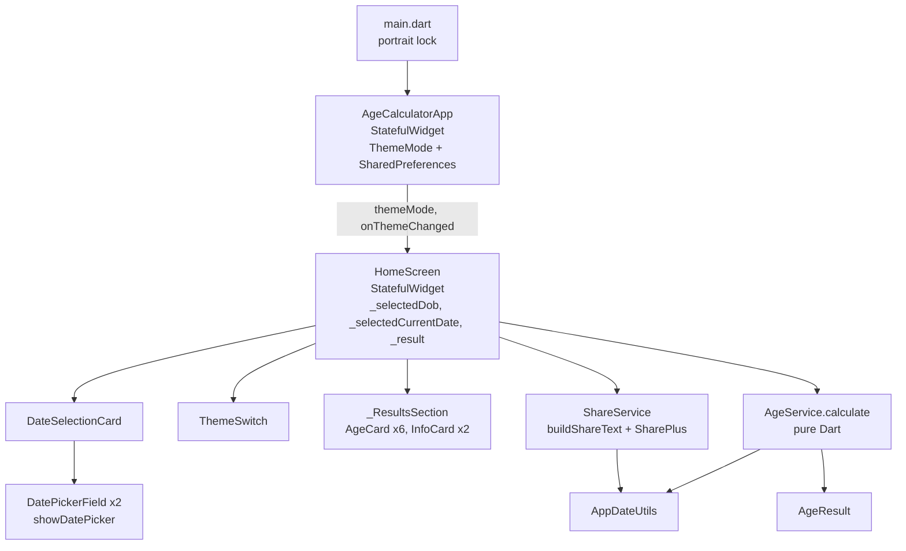

# Age Calculator — Current State Audit

| | |
|---|---|
| App | Age Calculator (`com.chandra.agecalculator`) |
| Audit date | 2026-10-03 |
| Commit audited | `8ebe849` (`main`, equal to `origin/main`) |
| Scope | Read-only audit. No application code, configuration, dependencies, CI, or version values were changed. |
| Audit environment | macOS 27.0.1 (arm64), Flutter 3.41.7 stable, Dart 3.11.5, Android SDK 36.1, Android Studio JBR 21.0.10, `Pixel_9a` emulator (API 37) |

How things were verified:

- **Inspected**: I read the file.
- **Ran**: I ran a command on this machine.
- **Emulator**: I saw it on the Android emulator.
- **Rendered**: I rendered the real widgets in a test harness that ran outside the repository.
- **Not verified**: I could not confirm it.

All experiments that needed extra files ran in a throwaway copy under `/tmp`. The repository itself was never touched.

---

## 1. Executive Summary

Age Calculator is a small offline Flutter app: 1,223 lines of Dart in `lib/`. It has a single screen, uses `setState`, and has three runtime dependencies (`shared_preferences`, `intl`, `share_plus`). The code is clean and easy to read, and the analyzer reports no issues.

**The headline features all exist**:

- Years, months, and days.
- An "as of" date.
- A next-birthday countdown.
- Totals in months, weeks, days, hours, and minutes.
- Light and dark themes.
- Sharing.
- Material 3.
- Offline operation: the release manifest has no INTERNET permission.

**However, the calculation engine has real, reproducible correctness bugs that users can see**:

1. **Negative "days" in the age.** For example, born 31 Jan 1990, as of 1 Mar 2026 gives **"36 years 1 month −2 days"**. This happens every 1–2 March for anyone born on the 30th or 31st of a month. Confirmed in the UI.
2. **Off-by-one errors in day-based results in daylight-saving time zones** (US, EU, UK, and others). Total days, total weeks, total hours, total minutes, "Age in Days", and the next-birthday countdown can each be wrong by one. Example: born 15 Mar 2000, as of 7 Jul 2026, in London or New York gives **9,609 days instead of 9,610**. India (IST) is not affected for modern dates.
3. **The "Weeks", "Hours", and "Minutes" result cards are wrong.**
   - "Weeks" shows `totalDays % 7`. That's the leftover *days* after whole weeks, not weeks.
   - "Hours" and "Minutes" are always **0** in time zones without daylight saving. Under daylight saving they show 23 or 1.
4. **Leap-day inconsistency.** For someone born on 29 Feb, on 28 Feb of a non-leap year the countdown says the birthday is today (0 days). At the same moment, the age says they haven't turned the new age yet (11 months 30 days).

**Engineering and process risks**:

- **No Gradle build of any kind works without `android/key.properties`.** Debug, release, `flutter run`, and CI all fail with `null cannot be cast to non-null type kotlin.String` at `android/app/build.gradle.kts:41`. That file isn't on this machine, so the production upload key is not available here.
- **No CI/CD at all.** There is no `.github/`, and there never has been in git history. There are no tags, no GitHub releases, and no recorded link between the Play release and a commit.
- **The SDK version has drifted.** The committed `pubspec.lock` was produced by a different Flutter SDK than this machine's 3.41.7. Running `flutter pub get` here would rewrite the lockfile, downgrading `meta` from 1.18.0 to 1.17.0 and `test_api` from 0.7.11 to 0.7.10.
- **Tests miss every bug above.** There are 10 tests, all passing, with 51.4% line coverage. They pass even under `TZ=Europe/London`.
- **The layout overflows** on 320dp-wide phones and at 130% and 200% text scale.
- **R8 and resource shrinking are disabled.** `classes.dex` is 9.4 MB uncompressed.

**Assessment**: the product is small and fixable. The biggest risk is shipping *wrong numbers* in an app whose only job is to compute numbers. The second is that no fix can be built or released in a repeatable way yet.

---

## 2. Current Project Structure

The repository tracks 95 files (`git ls-files`).

```
agecalculator/
├── lib/                                 (Dart app, 13 files, 1,223 LOC)
│   ├── main.dart                (14)    Entry point; locks portrait; runApp
│   ├── app.dart                 (89)    Root StatefulWidget; ThemeMode load/save (SharedPreferences)
│   ├── models/age_result.dart   (39)    Immutable result DTO (19 fields)
│   ├── services/age_service.dart(89)    Age calculation engine
│   ├── services/share_service.dart(41)  Share text builder + share_plus call
│   ├── utils/date_utils.dart    (67)    Leap year, daysInMonth, formatting, daysBetween, birthdayInYear
│   ├── theme/app_theme.dart     (70)    Material 3 light/dark ThemeData from seed #6750A4
│   ├── screens/home_screen.dart (398)   The only screen: inputs, actions, results
│   └── widgets/
│       ├── age_card.dart        (69)    Animated metric card
│       ├── info_card.dart       (91)    Animated label/value list card
│       ├── date_picker_field.dart(82)   Button that opens showDatePicker
│       ├── date_selection_card.dart(142) DOB + "as of" pickers + summary
│       └── theme_switch.dart    (32)    AppBar light/dark toggle
├── test/                                (167 LOC)
│   ├── age_service_test.dart            8 unit tests
│   ├── share_service_test.dart          1 unit test
│   └── widget_test.dart                 1 widget smoke test
├── android/                             Kotlin DSL Gradle; MainActivity is a bare FlutterActivity
├── ios/                                 Flutter template (display name "Agecalculator"); not a target
├── web/                                 Flutter template (name "agecalculator", default colours/icons)
├── assets/icon/README.md, assets/screenshots/README.md   Docs only; there are no actual asset files
├── README.md, LICENSE (MIT), analysis_options.yaml (flutter_lints defaults), pubspec.yaml, pubspec.lock
└── (absent) .github/, integration_test/, docs/ (until this file), l10n/arb files, CHANGELOG
```

`pubspec.yaml` declares no `assets:` and no fonts. The `assets/` folder holds README files only.

---

## 3. Technology Stack

| Item | Value | Evidence |
|---|---|---|
| Flutter (local) | **3.41.7 stable**, framework rev `cc0734ac71` (2026-04-15), engine `59aa584fdf` | Ran `flutter --version`. Matches the `.metadata` revision. |
| Dart (local) | **3.11.5** | Ran `dart --version` |
| Dart constraint | `sdk: ^3.11.5` | `pubspec.yaml` |
| Lockfile SDK bounds | `dart >=3.11.5 <4.0.0`, `flutter >=3.38.4` | `pubspec.lock` |
| Flutter used for last commit / production | **Not verified.** The lockfile pins `meta 1.18.0` and `test_api 0.7.11`, which Flutter 3.41.7 can't resolve, so a different SDK was used. | Ran `flutter pub get --dry-run` ("Would change 2 dependencies") |
| App version | `1.0.0+1`, giving **versionName 1.0.0, versionCode 1** | `pubspec.yaml`; merged release manifest |
| compileSdk | 36 (`flutter.compileSdkVersion`) | Flutter SDK `FlutterExtension.kt` |
| targetSdk | **36** | Merged release manifest |
| minSdk | **24** | Merged release manifest. README says 23, which is wrong. |
| NDK | 28.2.13676358 (Flutter default) | `FlutterExtension.kt` |
| AGP | 8.11.1 | `android/settings.gradle.kts` |
| Kotlin Gradle plugin | 2.2.20 | `android/settings.gradle.kts` |
| Gradle | 8.14 (`-all`) | `gradle-wrapper.properties` |
| Java source/target | 17 | `android/app/build.gradle.kts` |
| Build JDK (local) | OpenJDK 21.0.10 (Android Studio JBR) | `flutter doctor -v` |
| Direct deps | `shared_preferences ^2.5.3` (resolved 2.5.5), `intl ^0.20.2` (0.20.3), `share_plus ^13.2.0` (13.2.0) | `pubspec.yaml`, `pubspec.lock` |
| Dev deps | `flutter_test`, `flutter_lints ^6.0.0` (6.0.0) | `pubspec.yaml` |
| Notable transitive deps | `path_provider`, `jni` / `jni_flutter` (ships `libdartjni.so`), `url_launcher_*` (via share_plus), androidx DataStore (`libdatastore_shared_counter.so`) | `flutter pub deps`, AAB contents |
| Outdated | `share_plus` 13.2.0 → 13.3.1 available. 16 transitive packages are locked below their latest. | Ran `flutter pub outdated` |

**Capabilities. Each one was checked against the code.**

| Concern | Status | Evidence |
|---|---|---|
| State management | `StatefulWidget` + `setState`. The theme lives in `_AgeCalculatorAppState`; inputs and results live in `_HomeScreenState`. | `app.dart`, `home_screen.dart` |
| Architecture | Layered folders: models, services, utils, widgets, screens, theme. No controllers, providers, or blocs. | `lib/` |
| Navigation | None. `MaterialApp(home: …)` only. No routes, no `Navigator` calls. Dialogs and the share sheet are the only overlays. | `app.dart` |
| Dependency injection | None. Services are `const` fields created inside widget state. `ShareService` calls the static `SharePlus.instance`. | `home_screen.dart:26-27`, `share_service.dart:34` |
| Persistence | `SharedPreferences` key `theme_mode` (`light`/`dark`/`system`) only. Dates and results are **not** saved. | `app.dart:14,25-60` |
| Analytics / crash reporting / ads | **None** | Grep found no SDKs; manifest has no related entries |
| Notifications | **None** | No plugin, no manifest entries |
| Permissions (release) | None requested. Only the AndroidX internal `DYNAMIC_RECEIVER_NOT_EXPORTED_PERMISSION` (signature-level). | Merged release manifest |
| Network | **None** in release. `INTERNET` exists only in the `debug` and `profile` manifests, for Flutter tooling. | Manifests; grep of `lib/` |
| External APIs / third-party SDKs | None beyond the three packages above | `pubspec.yaml` |
| Localization | **None.** No `flutter_localizations`, no `supportedLocales`. All strings are hard-coded in English. `DateFormat` uses the default `en_US`. | Grep of `lib/` |

---

## 4. Current Architecture



The architecture is a classic "simple Flutter app" layout and fits the app's current size.

- **Business logic is separated from UI.** `AgeService` and `AppDateUtils` are pure Dart, depend only on `intl`, and are unit-testable. This is the strongest part of the codebase.
- **The UI is composed from small private and public widgets** (`_ActionButtons`, `_ResultsSection`, `AgeCard`, `InfoCard`).
- **State flow**:
  - Theme state is lifted to the root and passed down by callback (`onThemeChanged`).
  - Picking either date calls `_calculate(showValidationFeedback: false)` straight away (`home_screen.dart:83-93`). Results therefore update automatically, and the **Calculate** button only re-triggers the animation or shows validation messages.
- **No seams for testing side effects.** There is no injected clock or share abstraction, so the share flow and "today" handling can't be unit-tested in isolation.

---

## 5. Implemented Features

Everything below works offline and makes no network calls. Status reflects actual behaviour, bugs included.

| # | Feature | Where | User flow | Edge cases / limitations |
|---|---|---|---|---|
| F1 | Age in years / months / days | `AgeService._calculateCalendarAge` (`age_service.dart:49-70`) | Pick a DOB and results appear automatically | **Bug: can produce negative days** (§9.1). Uses local `DateTime`. |
| F2 | Age as of another date | `DateSelectionCard` second picker (`date_selection_card.dart:38-47`) | Change "Calculate Age As Of" (defaults to today) | **Past or today only**: `lastDate: AppDateUtils.today()`. You can't pick a future target date. Defaults to "today" as captured at `initState`, and isn't refreshed after midnight. |
| F3 | Next birthday countdown (days) | `AgeService._nextBirthday` and `daysBetween` | "Birthday Details → Next Birthday Countdown" | Shows "0 days" on the birthday, on the birth date itself (newborn), and for 29 Feb DOBs on 28 Feb. Off by one across daylight-saving changes (§9). Counted from the *as-of* date, not the real today. |
| F4 | Total months | `_totalCalendarMonths` | "Total Time Lived" | Calendar-correct |
| F5 | Total weeks | `totalDays ~/ 7` | "Total Time Lived" | Inherits the daylight-saving off-by-one through `totalDays` |
| F6 | Total days | `AppDateUtils.daysBetween` (`Duration.inDays` on local midnights) | "Total Time Lived" and "Age in Days" | **Off by one in daylight-saving zones** (§9.2) |
| F7 | Total hours / minutes | `today.difference(dob).inHours/inMinutes` | "Total Time Lived" | Real elapsed local time, so ±1 hour (±60 minutes) under daylight saving. Date-only inputs, no time of birth. |
| F8 | Birthday weekday | `AppDateUtils.weekdayName(dob)` | "Birthday Details → Birthday Weekday" | This is the weekday you were **born on**, not the weekday of your next birthday. The label is ambiguous. |
| F9 | Share result | `ShareService.shareResult` (share_plus `SharePlus.instance.share`) | Tap **Share** (disabled until there's a result) and the system share sheet opens | Plain text only. Includes DOB, as-of date, y/m/d, totals, and next-birthday days. Emulator: share sheet opened with the expected text. |
| F10 | Light/dark theme with persistence | `ThemeSwitch`, `app.dart` | AppBar icon toggles light ↔ dark; the choice is saved | The first launch follows the system. **Once toggled, there's no way back to "follow system".** |
| F11 | Date picker | `DatePickerField` with Material `showDatePicker` (calendar and text input modes) | Tap the field and pick or type a date | DOB range is 1900-01-01 to the as-of date. The picker **opens on today's date**, so finding a birth year takes many taps. Typed input uses **MM/DD/YYYY** (en_US only; no localizations). |
| F12 | Validation messages | `_validateDates` (`home_screen.dart:46-60`) | Tap **Calculate** with no DOB and a SnackBar appears ("Please select your date of birth first.") | The future-DOB and as-of-before-DOB checks can't be reached through the UI, because the picker bounds already prevent those inputs. "Unable to calculate age." is effectively dead. |
| F13 | Reset | `_reset` | Clears the DOB and sets the as-of date back to today | No confirmation (fine) |
| F14 | Material 3 UI | `AppTheme` (`useMaterial3: true`, `ColorScheme.fromSeed(#6750A4)`) | — | No dynamic colour (Material You) |
| F15 | Responsive width | `LayoutBuilder` breakpoint 600dp: 3-column grid and a single row of buttons | — | No max content width, so content stretches edge to edge on tablets (rendered) |
| F16 | Result entrance animation | `TweenAnimationBuilder` in `AgeCard` / `InfoCard` | Fade and slide each time the result key changes | 500–600 ms, lightweight |
| F17 | Portrait lock | `SystemChrome.setPreferredOrientations` (`main.dart`) | — | See §13 about large screens on API 36 |

## 6. Partially Implemented Features

| Feature | What exists | What's missing or wrong |
|---|---|---|
| "Weeks" result card | A card labelled **Weeks** | Value is `totalDays % 7`, i.e. leftover days (0–6), not weeks (`age_service.dart:32`). The emulator showed "3 Weeks" for a 26-year-old. |
| "Hours" / "Minutes" result cards | Cards labelled **Hours**, **Minutes** | Values are `totalHours % 24` and `totalMinutes % 60`. With date-only inputs these are always 0, or 23/1 under daylight saving. They carry no information. |
| "Calculate age as of any selected date" (Play listing) | Past and today | Future dates are blocked by `lastDate: AppDateUtils.today()` |
| "Important date differences" (Play short description) | Only DOB → as-of date, with as-of ≤ today | There's no general date-difference mode |
| Accessibility | One `Semantics(button: true, label: …)` on the date fields, plus a tooltip on the theme toggle | No semantic grouping for result cards (each value and label is a separate node; screen reader output **Not verified**). Layout overflows at large text scales (§8). |
| Large-screen support | 600dp breakpoint | No max width; portrait lock (see §13) |
| README | Present | Several inaccuracies (§10) |

## 7. Missing / Potential Features (not implemented; none exist in code)

- History / favourites / saved profiles. Nothing is persisted except the theme.
- Settings screen. The only setting is the theme toggle.
- Localization or multi-language support, and locale-aware date input.
- Notifications or birthday reminders. Listed on Play as "planned".
- Home-screen widgets. "Countdown widgets" are listed on Play as "planned".
- Event tracking and important-date management. Listed on Play as "planned".
- Time of birth. Required for meaningful hours and minutes.
- Future "as of" dates and a general date-difference calculator.
- Ads, analytics, crash reporting. Absent, which matches the Play Data safety form saying "No data collected".
- Integration tests and CI.

---

## 8. User Experience Findings

Evidence comes from emulator screenshots of the debug build installed on 2026-07-07, which has the same Dart code as HEAD. It also comes from widget renders at several sizes, text scales, and themes.

**What works well**

- The flow is clear on a modern phone (412×915dp). Results appear instantly when a DOB is picked.
- The Material 3 styling is consistent in light and dark. The dark theme renders correctly.
- Share is disabled until there's a result. The share sheet works.
- The Android back button behaves as expected: it closes the share sheet, then exits to the launcher. There's no navigation stack to break.

**Biggest UX problems, ranked**

1. **Wrong or meaningless numbers are shown prominently.** Three of the six large result cards (Weeks, Hours, Minutes) are mislabelled or always 0, and the age can show negative days. This damages trust in the core feature.
2. **Overflows on small screens and with large fonts.** Rendering found Flutter `RenderFlex` overflows. In release builds, overflowing content is clipped.
   - 320×568dp at 1.0× text scale: 28px bottom overflow in the result cards.
   - 412×915dp at 1.3×: 1.4px; at 2.0×: 38px.
   - 320×568dp at 2.0×: five overflows, up to 120px bottom and 39px right.
   - Cause: `GridView.count(childAspectRatio: 1.1)` gives the cards a fixed height (`home_screen.dart:302-309`).
3. **Picking a DOB is slow.** The DOB picker opens on today's date in day mode (`date_picker_field.dart:27`), so the user has to page or jump back decades. Text-input mode expects **MM/DD/YYYY** regardless of locale. For Indian users, who normally write DD/MM/YYYY, typing 03/04/2000 gives 4 March, not 3 April.
4. **Results are below the fold.** On a 412×915 phone, only the first row of cards is visible after picking a DOB. Nothing auto-scrolls, and on small phones the results are entirely off-screen.
5. **The Calculate button is redundant.** Results already update when a date is picked, so the button suggests a required step that doesn't exist.
6. **Duplicate information.** "Age in Months" equals "Total Months", and "Age in Days" equals "Total Days" (`age_service.dart:42-43`).
7. **Large numbers have no grouping separators.** For example, "13965120 minutes".
8. **Theme toggle limitation.** You can't return to "System".
9. **The "today" value goes stale.** If the app stays open past midnight, the as-of date stays at yesterday. Found by code inspection; not reproduced.
10. **No state restoration.** If Android kills the process (for example, while the user is in another app after sharing), the selected dates are lost. Found by code inspection (no `restorationScopeId`); not reproduced.

**Other observations**

| Area | Finding |
|---|---|
| First launch | Splash is the plain Flutter template (`launch_background.xml`). A one-frame `CircularProgressIndicator` appears while SharedPreferences loads. If the saved theme differs from the system theme, the theme may briefly flash (code inspection). |
| Empty state | Before a DOB is picked, the result area is empty and there's no explanation or illustration. |
| Error states | Only a SnackBar when there's no DOB. Other error paths can't be reached. |
| Loading states | Only the initial theme load |
| Landscape | Locked to portrait on phones. Wide layout renders without overflow at 915×412 and 1280×800. |
| Tablets | Content stretches to full width, e.g. 1280px-wide buttons and cards. |
| Material 3 | `useMaterial3: true`, seed colour, M3 components (FilledButton, OutlinedButton, Card with M3 surfaces). No dynamic colour. |
| Font scaling | Text scales, but the fixed-height cards overflow (above) |
| Launcher icon | Adaptive icon (API 26+) is custom. **The legacy `mipmap-*/ic_launcher.png` files are the default Flutter logo** (viewed `mipmap-xxxhdpi`), so API 24–25 devices show the Flutter logo. There's no monochrome layer for Android 13+ themed icons. |
| Offline | Fully offline (no network code, no INTERNET permission) |

---

## 9. Age Calculation Correctness

Method: a probe script ran against the real `AgeService` and `AppDateUtils` (imported from this repo's package config) under `TZ=Asia/Kolkata`, `TZ=America/New_York`, and `TZ=Europe/London`. Expected day counts were computed with UTC date arithmetic.

### 9.1 Negative days (month-end borrow) — **BUG, all time zones**

`_calculateCalendarAge` borrows the number of days in the *previous month of the as-of date* (`age_service.dart:57-62`). When that month is February and the DOB day is greater than February's length plus the as-of day, the day count stays negative.

| DOB → As of | App result | Expected (common convention) |
|---|---|---|
| 1990-01-31 → 2026-03-01 | **36y 1m −2d** (confirmed in the UI render) | 36y 1m 1d (Jan 31 + 1 month clamps to Feb 28, then +1 day) |
| 2023-01-31 → 2023-03-01 | 0y 1m **−2d** | 0y 1m 1d |
| 2023-01-30 → 2023-03-01 | 0y 1m **−1d** | 0y 1m 1d |
| 2024-01-31 → 2024-03-01 (leap) | 0y 1m **−1d** | 0y 1m 1d |
| 2023-01-31 → 2023-03-02 | 0y 1m **−1d** | 0y 1m 2d |

**Trigger**: the DOB falls on the 30th or 31st of any month, and the as-of date is 1 March, or 2 March in non-leap years when the DOB is on the 31st. Because "today" is the default as-of date, every affected user sees this every year on 1–2 March.

The convention for month-end dates is also inconsistent. For example, Mar 31 → Apr 30 gives 0m 30d, and Mar 31 → May 1 gives 1m 0d. That isn't strictly wrong, but it should be a documented convention.

### 9.2 Daylight saving and time zones — **BUG in DST-observing zones**

`AppDateUtils.daysBetween` and `AgeService` do arithmetic on **local** midnights and then call `Duration.inDays`, `inHours`, or `inMinutes` (`date_utils.dart:62-66`, `age_service.dart:17-23`). A local "day" that crosses the spring-forward change is 23 hours long, and `inDays` truncates it.

| Case (TZ) | totalDays (expected) | Other effects |
|---|---|---|
| 2000-03-15 → 2026-07-07 (London, New York) | **9609 (9610)** | "Weeks" card 5 instead of 6; "Hours" card **23**; totalHours 230639 (230640) |
| 2000-01-15 → 2026-07-07 (London, New York) | **9669 (9670)** | Hours card 23 |
| 2026-03-07 → 2026-03-09 (New York) | **1 (2)** | — |
| 2026-03-28 → 2026-03-30 (London) | **1 (2)** | — |
| Next birthday from 2026-03-01 for DOB 1990-04-01 (New York) | **30 (31)** | — |
| 2000-07-15 → 2026-01-07 (London, New York) | 9307 (correct) | totalHours +1, "Hours" card **1** |
| 1905-06-15 → 2026-10-03 (Kolkata, historical +05:21 offset) | **44304 (44305)** | Hours card 23, Minutes card 51 |
| 1943-01-01 → 2026-10-03 (Kolkata, wartime +06:30) | 30591 (correct) | totalHours +1 |
| Typical modern dates (Kolkata) | Correct | — |

Rule of thumb: in US and EU zones, **total days, total weeks, Age in Days, and hours/minutes are wrong by one roughly whenever the DOB falls in winter time and the as-of date in summer time.** The countdown is wrong whenever its span crosses spring-forward. Shared text is affected too.

### 9.3 Leap-day birthdays — **inconsistency**

| DOB 2000-02-29, as of | Age | Countdown |
|---|---|---|
| 2025-02-27 | 24y 11m 29d | 1 day |
| **2025-02-28** | **24y 11m 30d** (not yet 25) | **0 days** (birthday "today") |
| 2025-03-01 | 25y 0m 0d | 364 days |
| 2024-02-29 | 24y 0m 0d | 0 days |

`birthdayInYear` treats 28 Feb as the birthday in non-leap years (`date_utils.dart:55-60`), but the y/m/d engine increments the age on 1 March. The two must agree on a single convention (28 Feb or 1 Mar).

### 9.4 Other edge cases

| Case | Result | Assessment |
|---|---|---|
| DOB == as-of (newborn today) | 0y 0m 0d, countdown **0 days** | Questionable: the first birthday is 365 days away |
| Birthday today | 36y 0m 0d, countdown 0 days | Correct number, but no "Happy birthday" state; reads as "0 days" |
| Day before / after birthday | 35y 11m 29d / 36y 0m 1d; 1 / 364 days | Correct |
| Future DOB / as-of before DOB | `calculate` returns `null`; the UI pickers prevent these inputs | Correct |
| Very old (1900-01-01) | 126y 9m 2d (Kolkata) | y/m/d correct. totalDays was correct in Kolkata and wrong by one in New York and London (historical offsets). |
| Before 1900 | Can't be entered (`firstDate: DateTime(1900)`) | Limitation |
| Time-of-day components | Stripped to date-only for the arithmetic. `calculatedAt` keeps the raw value. | Fine. The field name `calculatedAt` actually means "as-of date". |
| Leap-year rule | `isLeapYear` is Gregorian-correct (1900 is not a leap year, 2000 is) | Correct |
| `daysInMonth` | Correct table plus leap February | Correct |
| Total months | `(Δy*12 + Δm) − (asOf.day < dob.day ? 1 : 0)` | Consistent with y/m |
| Invalid typed dates | Handled by Flutter's built-in `showDatePicker` validation | Not exercised in this audit |
| Midnight rollover while the app is open | As-of date stays at the old "today" until Reset | Code inspection |

**Verdict.** The calendar maths is correct for most ordinary inputs in India. It is **not** correct in general:

- Negative days appear in all time zones.
- Day counts are off by one in daylight-saving zones.
- Two of the result cards are mislabelled and one is meaningless.
- Leap-day birthdays get contradictory answers.

---

## 10. Code Quality Findings

**Positive**

- A small, clear folder structure with sensible names. Business logic is pure Dart, separate from widgets.
- Immutable model, `const` constructors throughout, and full null safety. The single `!` usages are guarded by checks.
- Async handling is correct: `if (!mounted) return;` after awaits (`app.dart:29,57`).
- Reusable widgets (`AgeCard`, `InfoCard`, `DatePickerField`).
- `flutter analyze`: **No issues found**.

**Findings**

| # | Finding | Evidence |
|---|---|---|
| Q1 | Logic bugs in core maths (see §9) | `age_service.dart`, `date_utils.dart` |
| Q2 | Misleading model fields: `weeks` = leftover days, `hours`/`minutes` = modulo of a date-only span, `calculatedAt` = as-of date. `ageInMonths`/`ageInDays` duplicate `totalMonths`/`totalDays`. | `age_service.dart:28-46`, `age_result.dart` |
| Q3 | `AgeResult` has no `==`, `hashCode`, or `toString`, which makes tests and debugging harder | `age_result.dart` |
| Q4 | No injectable clock or share abstraction. `DateTime.now()` and `SharePlus.instance` are called directly, so time and share behaviour are hard to test. | `date_utils.dart:23`, `share_service.dart:34` |
| Q5 | Unreachable code paths: future-DOB and as-of-before-DOB validation, and "Unable to calculate age." | `home_screen.dart:51-57,76-79` |
| Q6 | Hard-coded UI strings everywhere; no l10n layer | All widgets |
| Q7 | Fixed layout numbers that break with text scaling (`childAspectRatio` 1.1/1.4) | `home_screen.dart:308` |
| Q8 | `dart format` not applied: 8 of 16 Dart files would be reformatted (app, home_screen, share_service, age_card, date_selection_card, info_card, theme_switch, age_service_test) | Ran `dart format --output=none --set-exit-if-changed` (exit 1) |
| Q9 | Only the default `flutter_lints` set; no stricter rules | `analysis_options.yaml` |
| Q10 | `AppTheme.lightTheme`/`darkTheme` are getters that build a new `ThemeData` on every access (negligible today) | `app_theme.dart:8-10` |
| Q11 | README is out of date: says Min SDK 23 (actual 24); lists a non-existent `widgets/dob_picker.dart`; lists sharing under "Future Improvements" even though it's implemented; omits `share_plus` and `share_service_test.dart`; placeholder clone URL `<your-username>` | `README.md` |
| Q12 | Template leftovers for unused platforms: iOS display name "Agecalculator"; web manifest name "agecalculator" with default colours and icons | `ios/Runner/Info.plist`, `web/manifest.json` |
| Q13 | No TODO/FIXME/HACK comments and no `print`/`debugPrint` calls in `lib/` | grep |

**Architecture assessment.** For a single-screen utility of this size, `setState` and the plain-service structure are appropriate and maintainable. The main debts are correctness, testability seams (clock and share), and presentation semantics (labels and values). The state-management approach is not the problem. Adding features like history, reminders, or widgets would justify introducing a lightweight controller layer and a persistence abstraction later, not now.

---

## 11. Testing Status

**Run results**

- `flutter test --no-pub --coverage`: **10/10 passed**.
- `TZ=Europe/London flutter test --no-pub`: **10/10 passed**, so the suite can't detect the daylight-saving bugs.

**Line coverage: 51.4% (237/461)**

| File | Coverage |
|---|---|
| `services/age_service.dart` | 97.5% |
| `utils/date_utils.dart` | 97.0% |
| `theme/app_theme.dart` | 96.6% |
| `widgets/theme_switch.dart` | 90.0% |
| `services/share_service.dart` | 78.9% (`shareResult` not exercised) |
| `app.dart` | 75.0% (theme persistence path not exercised) |
| `widgets/date_picker_field.dart` | 60.0% |
| `widgets/date_selection_card.dart` | 35.4% |
| `screens/home_screen.dart` | 33.1% |
| `widgets/age_card.dart` | **0%** |
| `widgets/info_card.dart` | **0%** |

**What's tested**

- **Unit**:
  - One typical y/m/d case.
  - Feb 29: weekday, plus an assertion that the countdown is ≥ 0. That assertion is too weak to catch anything.
  - Feb 29 countdown on Feb 27.
  - Future DOB returns null.
  - A 10-day total.
  - Leap years, future-date check, and end-before-start check.
- **Unit**: share text contains the expected fields, built from a hand-made `AgeResult`, not computed values.
- **Widget**: the home screen shows its title, subtitle, and labels.
- **Integration**: none (there's no `integration_test/`).

**Not tested: critical business logic**

- Month-end borrowing (negative days)
- Daylight saving and time-zone independence
- `weeks`/`hours`/`minutes` values
- `totalWeeks`/`totalHours`/`totalMinutes`
- Countdown on the birthday, for a newborn, and on 28 Feb vs 1 Mar for leap-day DOBs
- Very old dates
- Total-months consistency with y/m

**Not tested: critical UI flows**

- Picking a DOB and seeing results
- Changing the as-of date
- Reset
- Calculate without a DOB (SnackBar)
- Share enabled or disabled, and share invocation
- Theme toggle and persistence across restarts
- Layout at 320dp and at 1.3× and 2.0× text scale
- Dark mode rendering
- Wide layout

**Recommended tests to add later (do not add now)**

1. A table-driven calendar test matrix covering:
   - Every DOB day from the 28th to the 31st × every as-of date from 28 Feb to 3 Mar, in leap and non-leap years.
   - Asserting `0 ≤ days < daysInMonth` and `0 ≤ months < 12`.
   - Asserting that DOB + y/m/d reconstructs the as-of date under the chosen convention.
2. Time-zone matrix tests: run the suite in CI under `TZ=UTC`, `Asia/Kolkata`, `America/New_York`, `Europe/London`, and `Australia/Sydney`.
3. Leap-day convention tests: age and countdown must agree on 28 Feb and 1 Mar.
4. Golden or overflow tests at 320×568 and 412×915, text scale 1.0, 1.3, and 2.0, in light and dark.
5. Widget flow tests: pick a date (the input mode is easy to drive), reset, the validation SnackBar, share button state, and theme persistence using `SharedPreferences.setMockInitialValues`.
6. Share tests with an injected share abstraction, asserting on text built from real calculated results.
7. One `integration_test` smoke test on an emulator in CI.

---

## 12. CI/CD Status

| Capability | Status |
|---|---|
| `.github/workflows/` | **Does not exist**, and has never existed in git history (`git log --all -- .github` is empty). GitHub's Actions page shows only the marketing page. |
| Flutter setup / dependency install / format / analyze / tests | None |
| Android build / AAB / APK / artifact upload | None |
| Release creation | None. GitHub "There aren't any releases here". |
| Version management | Manual (`pubspec.yaml` `version: 1.0.0+1`) |
| Secrets | None configured in the repo. The signing secrets file (`android/key.properties`) is git-ignored and **missing from this machine**. |
| Play Console deployment | None (manual upload assumed; **Not verified**) |
| Environment separation (dev/staging/prod, flavors) | None |

**Branch strategy**: a single `main` branch, tracking `origin/main`. There are no other local or remote branches (`git ls-remote` shows only `refs/heads/main`).

**CI blockers that already exist**

- Any Gradle build fails without `key.properties` (§13).
- `pubspec.lock` was produced by a different Flutter SDK, so CI must pin the exact SDK that matches the lockfile, or `pub get` will rewrite it.
- `android/gradle.properties` sets `-Xmx8G` for the Gradle JVM, which is heavy for hosted runners.

---

## 13. Android Configuration

| Item | Finding | Evidence |
|---|---|---|
| applicationId / namespace | `com.chandra.agecalculator` | `build.gradle.kts` |
| min / target / compile SDK | 24 / 36 / 36 | Merged release manifest; `FlutterExtension.kt` |
| version | versionCode 1, versionName 1.0.0 | Merged manifest |
| **Signing** | `signingConfigs.create("release")` casts `keystoreProperties[...] as String` eagerly. Without `android/key.properties`, **every build variant fails at configuration time.** | Ran: `flutter build appbundle --release` gives `build.gradle.kts line: 41 — null cannot be cast to non-null type kotlin.String`. Ran (copy): `flutter build apk --debug` fails the same way. |
| Keystore location | `android/key.properties` and `android/app/upload-keystore.jks` are git-ignored. **Neither file is on this machine.** The signing commit was authored elsewhere and pulled here on 2026-09-09 (`git reflog`). | `.gitignore`, `android/.gitignore` |
| Play App Signing enrolment | **Not verified** | — |
| R8 / shrinking | `isMinifyEnabled = false`, `isShrinkResources = false`. There are no ProGuard rule files. | `build.gradle.kts:51-52` |
| Debug vs release | The debug and profile manifests add `INTERNET` (tooling). Release has no permissions. | Manifests |
| Exported components | `MainActivity` (launcher, required); `androidx.profileinstaller.ProfileInstallReceiver` (exported, protected by `android.permission.DUMP`, standard AndroidX). The share_plus `ShareFileProvider` and `SharePlusPendingIntent` are **not exported**. | Merged manifest |
| Backup | No `allowBackup`, `fullBackupContent`, or `dataExtractionRules`, so the default is backup enabled. The emulator package flags show `ALLOW_BACKUP`. Only the theme preference would be backed up. | Merged manifest; `dumpsys package` |
| Network security config | None (no network use) | — |
| Deep links / intent filters | Only MAIN/LAUNCHER. A `<queries>` entry for `PROCESS_TEXT` comes from the Flutter template. | Manifest |
| Notifications | None | — |
| Orientation | Portrait set from Dart (`SystemChrome`), not in the manifest. Android 16 ignores orientation and resizability restrictions on large screens (smallest width ≥ 600dp) for apps targeting API 36. That's platform documentation, **not verified on a large-screen device here**. The ≥600dp layout rendered without overflow in landscape. | `main.dart` |
| Native libraries / 16 KB pages | All `.so` LOAD segments are aligned to 0x4000 or 0x10000 (`llvm-readelf`). The release APK passes `zipalign -c -P 16`. | Ran on a build from the throwaway copy |
| Gradle flags | `android.builtInKotlin=false`, `android.newDsl=false` (added by the Flutter migrator). These defer the AGP 9 migration and count as technical debt. | `gradle.properties` |
| Launcher icon | Adaptive icon is custom (no monochrome layer). Legacy PNGs are the default Flutter logo. | Resources |
| Splash | Template `launch_background.xml` (plain `?android:colorBackground`) | Resources |

---

## 14. Security & Privacy Findings

| Check | Result |
|---|---|
| Hard-coded secrets, API keys, tokens, credentials | **None found** (grep across `lib/`, `android/app/src`, `ios/Runner`, `web/`, `pubspec.yaml`) |
| Keystore / signing secrets in git | Not tracked. They're git-ignored, and `git ls-files` contains no `.jks` or `key.properties`. |
| Sensitive data storage | Only `theme_mode` in SharedPreferences. DOB is never persisted. |
| Network calls / dev endpoints | None. No INTERNET permission in release. |
| Logging | No `print`, `debugPrint`, or `log` in `lib/` |
| Debug code | `debugShowCheckedModeBanner: false`. No `kDebugMode` branches. |
| Unnecessary permissions | None |
| Exported components | Only the expected ones (§13) |
| Third-party data flows | None. Sharing is user-initiated through the Android share sheet. |
| Play Data safety ("No data collected / shared") | Consistent with the code |
| Public repository | GitHub repo `ChandraChaan/age-calculator-flutter` is public. Nothing sensitive was found in tracked files. |
| Operational risk | The **upload key is not on this machine**. If it exists on only one other machine with no backup, future updates depend on that machine, or on a Play upload-key reset if App Signing is enabled (**Not verified**). |

---

## 15. Performance Findings

| Item | Finding |
|---|---|
| Calculation cost | O(1) date maths; negligible |
| Rebuilds | `setState` rebuilds the whole `HomeScreen` on each change. That's trivial at this size. Results are rebuilt with a new key to replay animations. |
| Animations | Eight `TweenAnimationBuilder`s (500–600 ms) per result. Lightweight. |
| Startup | One `SharedPreferences.getInstance()` before the home screen (a single loading frame). Emulator cold start of the **debug** build: `TotalTime 2735 ms` (debug builds aren't representative; release startup **Not verified**). |
| Network | None |
| Assets | No images or fonts bundled. MaterialIcons is tree-shaken from 1,645,184 to 4,520 bytes. |
| **AAB size** (throwaway-signed release build of HEAD with Flutter 3.41.7) | **44.2 MB** total. 48.9 MB uncompressed of that is native debug symbols in `BUNDLE-METADATA`, which aren't delivered to devices. Three ABIs are included. |
| Estimated arm64 per-device payload | About **25.8 MB uncompressed / 10.6 MB compressed**: `libflutter.so` 11.3 MB, `libapp.so` 4.8 MB, `classes.dex` **9.4 MB** + `classes2.dex` 0.3 MB, resources about 0.8 MB. This is consistent with the ~11.2 MB you quoted, but the actual Play download size is **Not verified**. |
| Shrinking | R8 is off, so the full AndroidX and Kotlin libraries ship in the dex. Enabling R8 would likely cut the dex size substantially (not measured). |
| Universal release APK (arm64 only, copy) | 20.7 MB |

---

## 16. Play Store / Production Readiness

Play listing fetched on 2026-10-03: "Updated on Aug 13, 2026"; What's new: "Initial release"; Data safety: "No data collected", "No data shared".

| Feature | Advertised | Actually implemented | Evidence / file | Notes |
|---|---|---|---|---|
| Exact age in years, months, days | Yes | **Yes, with a bug** | `age_service.dart:49-70` | Negative days on 1–2 March for DOB days 30/31; DST effects don't touch y/m/d |
| Age as of any selected date | Yes | **Partial** | `date_selection_card.dart:43-44` | Past and today only; future dates blocked |
| Next birthday countdown | Yes | **Yes, with edge bugs** | `age_service.dart:25-26,80-88` | Off by one across DST; 0 days for newborns; Feb 29 inconsistency |
| Total years | Yes | Yes ("Years" card) | `home_screen.dart:310-315` | — |
| Total months | Yes | Yes | `_totalCalendarMonths` | Correct |
| Total weeks | Yes | Yes (Total Time Lived) | `age_service.dart:21` | DST off-by-one through totalDays. The separate "Weeks" card is wrong (§6). |
| Total days | Yes | **Yes, with a bug** | `date_utils.dart:62-66` | DST off-by-one |
| Total hours | Yes | Yes | `age_service.dart:22` | ±1 h under DST; "Hours" card meaningless |
| Total minutes | Yes | Yes | `age_service.dart:23` | ±60 under DST; "Minutes" card meaningless |
| Light & dark theme | Yes | Yes | `app_theme.dart`, `theme_switch.dart` | Can't return to "System" after toggling |
| Share results | Yes | Yes | `share_service.dart` | Verified on the emulator |
| Clean Material 3 design | Yes | Yes | `app_theme.dart:21` | No dynamic colour; small-screen overflow |
| Fast, lightweight, works offline | Yes | Yes (offline verified) | Release manifest has no INTERNET | Size claims: see §15 |
| "Important date differences" (short description) | Implied | **Partial** | — | DOB → past/today only |
| Event tracking, countdown widgets, reminders, date management | "Planned" | **No** | — | Correctly labelled as future |

**Production-quality concerns**

- Wrong numbers in core results (§9). This is the most likely source of negative reviews.
- No reproducible build path on this machine, and no CI.
- Production versionCode **Not verified** (listing says initial release; repo says `+1`). The next upload must use a higher versionCode than whatever is live.
- targetSdk 36 is the Flutter 3.41.7 default. Compliance with future Play target-API deadlines will need monitoring (**Not verified** against the current Play deadline).
- 16 KB page-size compliance: verified for a local build. The production artifact itself is **Not verified**.

---

## 17. Git / Release Status

| Item | Value |
|---|---|
| Current branch | `main` (up to date with `origin/main`; working tree clean) |
| Latest commit | `8ebe849`, 2026-07-07 18:08 +0530, Chandra ObulaReddy: "Add release signing configuration for Android and update dependencies" |
| Latest tag | **None** (local and remote) |
| Total commits | 4 |
| History | `7801fd0` Initial commit (GitHub-created LICENSE) → `8e4ba2e` Initial commit (full project, made on this machine) → `de38e55` merge (LICENSE conflict) → `8ebe849` signing config + `pubspec.lock` bump |
| Release-related commits | `8ebe849`: release signing, `isMinifyEnabled=false`, migrator flags, lockfile change (`meta` 1.17.0 → 1.18.0, `test_api` 0.7.10 → 0.7.11) |
| Production release ↔ commit | **Not verified.** There's no tag, and the Play update (13 Aug 2026) is after the last commit (7 Jul 2026). |
| Major architectural changes | None since the initial commit. `lib/` and `test/` haven't changed since `8e4ba2e`. |
| Unfinished work / TODOs | No TODO or FIXME comments. README checklist items are unchecked. `assets/screenshots/` contains only a README. |
| Recently changed areas | Android build configuration only (`build.gradle.kts`, `gradle.properties`, `.gitignore`, `pubspec.lock`) |
| Reflog note | This machine received `8ebe849` by fast-forward pull on 2026-09-09, so the signing setup was made on a different machine. |

---

## 18. Bugs / Risks Found

| ID | Severity | Description | Evidence |
|---|---|---|---|
| B1 | High | Age can show **negative days** (e.g. 36y 1m −2d) | Probe A1–A6; UI render |
| B2 | High | **Total days / weeks / Age in Days are off by one** in daylight-saving time zones | Probe F1, H1 (London, New York) |
| B3 | High | **"Weeks" card shows leftover days**; **"Hours"/"Minutes" cards are always 0** (or 23/1 under DST) | `age_service.dart:32-34`; emulator screenshot |
| B4 | Medium | **Next-birthday countdown off by one** across spring-forward | Probe F3 (New York) |
| B5 | Medium | **Feb 29 birthdays**: countdown says 0 on 28 Feb while the age says not yet | Probe B1 |
| B6 | Medium | **Newborn countdown** shows 0 days instead of 365 | Probe C1 |
| B7 | Medium | **Layout overflow** at 320dp and at 1.3× and 2.0× text | Render harness |
| B8 | Medium | Typed date input is **MM/DD/YYYY only**, so DD/MM users can enter the wrong DOB without noticing | Emulator (input `03/15/2000` accepted as 15 March) |
| B9 | Low | Total hours/minutes ±1 h for historical offsets and DST | Probe E2, E3, F2 |
| B10 | Low | As-of "today" goes stale after midnight while the app is open | Code inspection |
| B11 | Low | Legacy launcher icons are the Flutter logo (API 24–25) | `mipmap-*/ic_launcher.png` |
| R1 | **Critical (process)** | No Gradle build works without `key.properties`, and that file isn't on this machine | Ran build |
| R2 | High (process) | Upload keystore custody unknown | §14 |
| R3 | High (process) | No CI, no tags, no release traceability | §12, §17 |
| R4 | Medium (process) | Flutter SDK drift vs `pubspec.lock`; `flutter pub get` rewrites the lockfile | Ran `--dry-run`. During this audit `flutter pub outdated`/`deps` rewrote it once, and it was restored with `git checkout`. |
| R5 | Medium | Tests can't detect any of B1–B9 | §11 |
| R6 | Low | Android 16+ large screens may ignore the portrait lock | §13 (platform documentation) |

---

## 19. Technical Debt

- Signing configuration that crashes without secrets, instead of degrading gracefully.
- No pinned Flutter version (no FVM, `.tool-versions`, or CI pin), and the lockfile was produced by a different SDK.
- Local-time arithmetic throughout the date code.
- Misnamed and duplicated `AgeResult` fields (`weeks`, `hours`, `minutes`, `calculatedAt`, `ageInMonths`, `ageInDays`).
- No clock or share abstractions, so time and share behaviour are hard to test.
- Hard-coded English strings; no l10n scaffolding.
- Fixed-aspect-ratio grid cards.
- Code not formatted with `dart format` (8 files).
- R8 disabled; Gradle migrator flags deferring AGP 9 changes; `-Xmx8G` Gradle heap.
- Template leftovers: default launch screen, legacy Flutter-logo mipmaps, iOS and web template names and icons.
- README inaccurate in several places.
- No CHANGELOG, tags, or release notes in the repo.

---

## 20. Recommended Improvements

### P0 — Critical

**P0-1. Make the project buildable without secrets, and secure the upload key**

- **Problem**: Any Gradle build fails when `android/key.properties` is absent. The file isn't on this machine, and where the upload key is kept is unknown.
- **Why it matters**: You can't build a fix, run the app locally, or set up CI. If the key is lost, updates are blocked.
- **Proposed solution**:
  - Create the release `signingConfig` only when `key.properties` exists. Otherwise fall back to unsigned or debug signing for local builds, and fail only for release bundles.
  - Locate and back up the upload keystore, and record where it's kept.
  - Confirm Play App Signing enrolment in Play Console.
- **Files**: `android/app/build.gradle.kts`; private credential storage outside the repo.
- **Risk**: Low code risk, but release signing must keep using the existing upload key.
- **Complexity**: Low

**P0-2. Fix negative days (month-end borrow) and define the calendar convention**

- **Problem**: y/m/d can produce negative days (§9.1).
- **Why it matters**: The core output is visibly wrong for about 5% of birth dates every 1–2 March.
- **Proposed solution**:
  - Compute y/m/d by adding whole months to the DOB, clamping to month end.
  - Document the convention, including the leap-day rule.
  - Add the test matrix from §11 first.
- **Files**: `lib/services/age_service.dart`, `lib/utils/date_utils.dart`, `test/age_service_test.dart`.
- **Risk**: Medium. Some users will see a different day count than before.
- **Complexity**: Low

**P0-3. Make date arithmetic independent of time zones and daylight saving**

- **Problem**: Local-midnight `Duration` maths loses or gains an hour across DST (§9.2).
- **Why it matters**: Totals and the countdown are off by one for US and EU users.
- **Proposed solution**:
  - Normalise to `DateTime.utc(y, m, d)` for every day count.
  - Derive hours and minutes as `days × 24` and `days × 1440`, or clearly label them as elapsed time.
  - Run tests under multiple time zones.
- **Files**: `lib/utils/date_utils.dart`, `lib/services/age_service.dart`, tests.
- **Risk**: Low
- **Complexity**: Low

**P0-4. Fix the "Weeks", "Hours" and "Minutes" result cards**

- **Problem**: Wrong labels or semantics: leftover days shown as weeks, and hours/minutes that are always 0.
- **Why it matters**: Three of the six headline cards mislead users.
- **Proposed solution**:
  - Choose one: remove the three cards; redefine them as a breakdown of the remaining days (e.g. "2 weeks 4 days"); or show headline totals.
  - Update the share text to match.
- **Files**: `age_service.dart`, `age_result.dart`, `home_screen.dart`, `share_service.dart`, tests.
- **Risk**: Low (visible UI change)
- **Complexity**: Low

### P1 — Important

**P1-1. Add regression tests for the calculation engine**

- **Problem**: The current tests miss every calculation bug.
- **Why it matters**: Without a safety net, fixes can't be trusted.
- **Proposed solution**: Table-driven matrix, leap-day cases, newborn and birthday-today cases, and very old dates, run under several time zones. Inject a clock.
- **Files**: `test/`, plus an optional clock parameter on `AgeService` and `AppDateUtils.today`.
- **Risk**: Low
- **Complexity**: Medium

**P1-2. Set up CI (GitHub Actions)**

- **Problem**: There's no automation at all.
- **Why it matters**: Catches regressions and gives reproducible builds.
- **Proposed solution**: A workflow that:
  - Pins the Flutter version.
  - Runs `flutter pub get --enforce-lockfile`, `dart format --set-exit-if-changed`, `flutter analyze`, and `flutter test` (with a time-zone matrix).
  - Builds a debug APK and a release AAB (signed from GitHub secrets, or unsigned) and uploads the artifact.
- **Files**: `.github/workflows/ci.yml` (new). Depends on P0-1.
- **Risk**: Low
- **Complexity**: Medium

**P1-3. Pin and document the Flutter SDK; reconcile the lockfile**

- **Problem**: The lockfile came from a different SDK, and the production SDK is unknown.
- **Why it matters**: Builds aren't reproducible, and `pub get` rewrites tracked files.
- **Proposed solution**:
  - Identify the SDK used for the production build.
  - Pin it with FVM or `.tool-versions`, and use the same version in CI.
  - Regenerate the lockfile once, intentionally.
- **Files**: `pubspec.lock`, new pin file, README.
- **Risk**: Low
- **Complexity**: Low

**P1-4. Make birthday countdown and age agree**

- **Problem**: Leap-day mismatch; newborns get a 0-day countdown; "0 days" on the birthday.
- **Why it matters**: Contradictory answers in the same screen.
- **Proposed solution**:
  - Use one leap-day convention for both the age and the countdown.
  - Handle DOB == as-of.
  - Optionally add a "Happy birthday" state.
- **Files**: `age_service.dart`, `date_utils.dart`, `home_screen.dart`.
- **Risk**: Low
- **Complexity**: Low

**P1-5. Fix small-screen and large-font overflows**

- **Problem**: Fixed-ratio grid cards overflow.
- **Why it matters**: Clipped values for accessibility users and on small phones.
- **Proposed solution**: Size cards by their content (e.g. `Wrap` or a `SliverGrid` with `mainAxisExtent` computed from text scale). Verify at 320dp and 2.0× text.
- **Files**: `home_screen.dart`, `age_card.dart`.
- **Risk**: Low
- **Complexity**: Low–Medium

**P1-6. Locale-aware date input and formatting**

- **Problem**: Typed input only accepts MM/DD/YYYY, and all dates are formatted in English.
- **Why it matters**: DD/MM users (India) can enter the wrong DOB without noticing.
- **Proposed solution**: Add `flutter_localizations` with `supportedLocales` (en-IN at minimum) and pass the locale to `DateFormat`.
- **Files**: `pubspec.yaml`, `app.dart`, `date_utils.dart`.
- **Risk**: Medium (adds a dependency; changes formats)
- **Complexity**: Low

**P1-7. Allow future "as of" dates, or align the listing text**

- **Problem**: The Play listing says "any selected date", but only past dates and today are allowed.
- **Why it matters**: The product doesn't match what's advertised.
- **Proposed solution**: Allow a future `lastDate` (e.g. +100 years) and keep the validation, or reword the listing.
- **Files**: `date_selection_card.dart`, `home_screen.dart`.
- **Risk**: Low
- **Complexity**: Low

**P1-8. Release discipline: versioning, tags, changelog**

- **Problem**: No tags, no changelog, and the production version is unknown.
- **Why it matters**: You can't map Play releases to code or roll back cleanly.
- **Proposed solution**:
  - Tag the commit that matches production (once identified).
  - Bump to e.g. `1.0.1+2` for the fix release.
  - Add a `CHANGELOG.md`.
- **Files**: `pubspec.yaml` (at release time), new `CHANGELOG.md`.
- **Risk**: Low
- **Complexity**: Low

**P1-9. Enable R8 and resource shrinking**

- **Problem**: The dex is 9.4 MB uncompressed with no shrinking.
- **Why it matters**: Download and install size.
- **Proposed solution**: Turn on `isMinifyEnabled` and `isShrinkResources`, add keep rules only if needed, and smoke-test sharing and preferences on a release build.
- **Files**: `android/app/build.gradle.kts`, optional `proguard-rules.pro`.
- **Risk**: Medium (R8 can break reflection-based plugins)
- **Complexity**: Low–Medium

### P2 — Useful

| ID | Problem → Proposed solution | Files | Risk | Complexity |
|---|---|---|---|---|
| P2-1 | DOB picker opens on today → open in year mode (`initialDatePickerMode: DatePickerMode.year`) or at a sensible default year | `date_picker_field.dart` | Low | Low |
| P2-2 | Results below the fold, and a redundant Calculate button → auto-scroll to results; remove or rename Calculate | `home_screen.dart` | Low | Low |
| P2-3 | Can't return to "System" theme → three-way selector (System/Light/Dark), keeping the existing `theme_mode` key and values | `theme_switch.dart`, `app.dart` | Low | Low |
| P2-4 | Unreadable large numbers → `NumberFormat.decimalPattern(locale)` | `home_screen.dart`, `share_service.dart` | Low | Low |
| P2-5 | Duplicate and ambiguous metrics → drop "Age in Months/Days" duplicates; rename "Birthday Weekday" to "Day you were born"; add "Next birthday falls on …" | `home_screen.dart`, `age_result.dart` | Low | Low |
| P2-6 | Accessibility → `MergeSemantics` or semantic labels on cards ("26 years"), TalkBack audit, contrast check | `age_card.dart`, `info_card.dart` | Low | Low |
| P2-7 | Stale "today" and lost state → refresh on app resume (`WidgetsBindingObserver`); restoration of selected dates | `home_screen.dart` | Low | Medium |
| P2-8 | Icon polish → regenerate legacy mipmaps from the custom icon; add a monochrome adaptive layer; branded splash | `android/app/src/main/res/` | Low | Low |
| P2-9 | Testability → inject clock and share interface; value equality on `AgeResult`; rename `calculatedAt` to `asOfDate` | `services/`, `models/` | Low | Low |
| P2-10 | Code hygiene → run `dart format`; adopt stricter lints gradually; fix README inaccuracies | All Dart files, `analysis_options.yaml`, `README.md` | Low | Low |
| P2-11 | Large screens → max content width (~720dp); verify behaviour on Android 16+ tablets and foldables | `home_screen.dart` | Low | Low |
| P2-12 | Explicit backup policy → declare `dataExtractionRules` / `fullBackupContent` (only the theme preference) | `AndroidManifest.xml`, `res/xml` | Low | Low |

### P3 — Future

| ID | Idea | Notes | Risk | Complexity |
|---|---|---|---|---|
| P3-1 | History / saved people (local only) | Needs a persistence layer (e.g. a SQLite or JSON store) and a state-management upgrade | Medium | Medium |
| P3-2 | Birthday reminders / notifications | Adds the `POST_NOTIFICATIONS` permission and scheduling. Update the Data safety form if anything leaves the device. | Medium | Medium–High |
| P3-3 | Home-screen countdown widget | Native Android widget plus a data bridge (Play listing "planned") | Medium | High |
| P3-4 | Event tracking / important-date manager / date-difference calculator | Play listing "planned" | Medium | Medium–High |
| P3-5 | Time-of-birth input | Would make hours and minutes meaningful | Low | Medium |
| P3-6 | Localization (Hindi, Telugu, etc.) | Builds on P1-6 | Low | Medium |
| P3-7 | Play Console deployment automation (internal track first) | e.g. Fastlane or a GitHub Action with a service account | Medium | Medium |
| P3-8 | Material You dynamic colour | `dynamic_color` package | Low | Low |
| P3-9 | Crash reporting / analytics | **Only** with an updated privacy policy and Data safety form. Currently "No data collected". | High (policy) | Medium |

---

### Appendix A — Commands run and results

| Command | Result |
|---|---|
| `flutter --version` / `dart --version` | Flutter 3.41.7 stable (rev cc0734ac71) / Dart 3.11.5 |
| `flutter doctor -v` | Android toolchain OK (SDK 36.1.0, licences accepted). Xcode: CocoaPods broken, iOS 27 simulator missing (not relevant to Android). No Android device connected. |
| `flutter pub get --dry-run` | Would downgrade `meta` 1.18.0→1.17.0 and `test_api` 0.7.11→0.7.10, so plain `pub get` was **not** run |
| `flutter analyze --no-pub` | **No issues found** |
| `dart format --output=none --set-exit-if-changed lib test` | 8 of 16 files would change (exit 1) |
| `flutter test --no-pub --coverage` | **10/10 passed**, 51.4% line coverage |
| `TZ=Europe/London flutter test --no-pub` | 10/10 passed |
| `flutter build appbundle --release --no-pub` (repo) | **FAILED**: `build.gradle.kts:41 null cannot be cast to non-null type kotlin.String` |
| `flutter build apk --debug --no-pub` (throwaway copy, no key) | **FAILED** with the same error |
| `flutter build appbundle --release --no-pub` (throwaway copy + temporary keystore) | Built, **44.2 MB** AAB; merged manifest min 24 / target 36 / versionCode 1 |
| Emulator `Pixel_9a` (API 37) | Installed app: the 2026-07-07 debug build (versionCode 1, debuggable). Launch, DOB entry, results, share sheet, and back behaviour inspected. |

### Appendix B — Side effects during the audit (all reverted)

- `flutter pub outdated` / `flutter pub deps` rewrote `pubspec.lock` once (the same `meta`/`test_api` downgrade). It was restored with `git checkout -- pubspec.lock`. The working tree was verified clean afterwards.
- The failed release build changed `flutter.buildMode` in the git-ignored, Flutter-managed `android/local.properties` from `debug` to `release`. It was set back to `debug`.
- Gradle and Flutter build caches under the git-ignored `build/` directory were updated by the failed build attempt.
- These artifacts were kept outside the repository and can be deleted at any time:
  - `/tmp/agecalc-audit-copy`: the build copy, including a throwaway 1-day keystore unrelated to production.
  - `/tmp/agecalc_probe`: the calculation probe and the render-harness test.
  - `/tmp/agecalc_screens`: the screenshots.
  - `/tmp/agecalc_so`: native libraries extracted for the alignment check.
  - `/tmp/agecalc_emulator.log`.
- A UI dump file created on the emulator was deleted, and the emulator was shut down.
