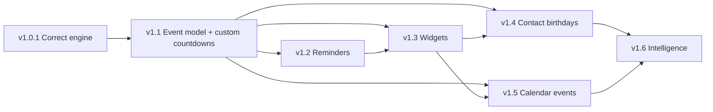
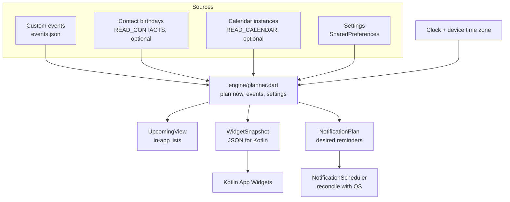
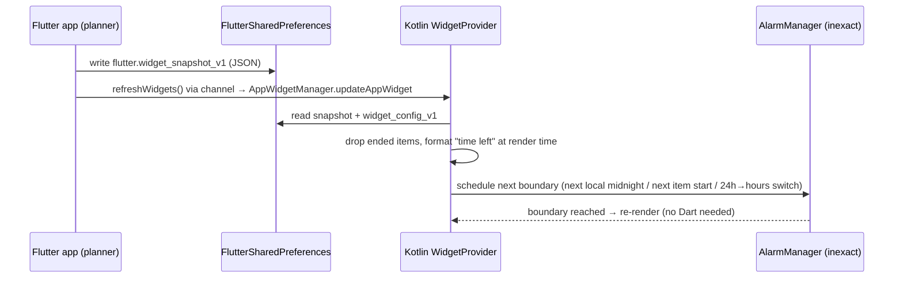

# Age Calculator — Future Product Architecture

| | |
|---|---|
| Status | Design proposal. Nothing in this document is implemented. |
| Date | 2026-10-03 |
| Baseline | Commit `8ebe849`, plus `docs/CURRENT_STATE_AUDIT.md` (the source of truth for current state) |
| Out of scope | Signing, keystores, CI/CD, GitHub Actions, Play Store deployment |

Each claim carries one of three tags:

- **[Repo]**: checked in this repository.
- **[Doc]**: checked in Android or plugin documentation, or in plugin source in the local pub cache, during this design pass.
- **[Verify]**: an assumption that must be confirmed during implementation.

Every component marked **NEW** does not exist today.

---

## 1. Product vision

**From:** "Calculate my age."
**To:** "Tell me what important date or event is coming next, and how much time is left."

The app becomes a **privacy-first personal countdown engine**. It merges three sources of events into one timeline:

- events you create;
- birthdays from your contacts (optional);
- events from your calendar (optional).

It then presents that timeline in-app, in home-screen widgets, and through reminders. The existing age calculator stays as a first-class feature, because it is the reason current users installed the app.

### Product principles

1. **Correct first.** A countdown app that shows wrong numbers has no value. The calculation bugs in the audit (§9 there) are fixed before any new feature ships.
2. **Fully useful with zero permissions.** Custom countdowns, the age calculator, widgets, and in-app countdowns all work without any permission. Calendar, contacts, and notifications are opt-in enhancements.
3. **On-device only.** Data flows device → local storage → local engine → UI, widget, or notification. There is no backend, no account, and no analytics. The release manifest has no INTERNET permission today **[Repo]**, and keeping it that way is a design goal.
4. **Read-only access to personal data.** The app never writes to the user's calendar or contacts.
5. **Honest about Android limits.** Widgets and reminders update at the cadence Android allows. The app never assumes continuous background execution.
6. **Not a medical app.** Health-related entries are plain dates and reminders. See §2.3.

### Non-goals (for this roadmap)

- Cloud sync, accounts, or a backend.
- Ads, analytics, or crash-reporting SDKs. These would change the Play Data safety answers, which currently say "No data collected" (audit §16).
- Editing calendar or contacts data.
- Medical diagnosis, prediction, or advice.
- iOS. An `ios/` template folder exists, but it is not a target **[Repo]**.

---

## 2. Feature map

### 2.1 Features and what they build on

| Feature | Builds on (current code) | Permission | Native Android code | Release |
|---|---|---|---|---|
| Age calculator (fixed) | `lib/screens/home_screen.dart`, `lib/services/age_service.dart`, `lib/utils/date_utils.dart` | None | No | v1.0.1 |
| Custom countdowns (CRUD, categories, notes) | **NEW** model, store, and screens. Reuses `AppTheme`, `AgeCard` and `InfoCard` styling. | None | No | v1.1 |
| Recurring dates (yearly, monthly, weekly, every N days) | **NEW** `engine/recurrence.dart`, reusing month and leap logic from `date_utils.dart` | None | No | v1.1 |
| Upcoming list / "What's next?" | **NEW** occurrence expander + selector | None | No | v1.1 |
| Live countdown (to the second, in-app) | **NEW** `engine/countdown.dart` | None | No | v1.1 |
| Share a countdown | Extends `lib/services/share_service.dart` | None | No | v1.1 |
| Reminders (1 day, 3 h, 1 h, 30 min, 10 min, custom) | **NEW** planner + scheduler | `POST_NOTIFICATIONS`; optional exact alarms | Plugin | v1.2 |
| Private / personal (incl. health-related) reminders | Category + sensitivity flag | None beyond notifications | No | v1.2 |
| Home-screen widgets: single, multiple, auto "What's next?" | **NEW** Kotlin App Widgets fed by a Dart-built snapshot | None | **Yes** | v1.3 |
| Contact birthdays | **NEW** contacts reader | `READ_CONTACTS` | **Yes** | v1.4 |
| Calendar events | **NEW** calendar reader | `READ_CALENDAR` | **Yes** | v1.5 |
| Smart ranking, daily digest, auto-categorisation, travel time zones | Engine extensions | None | No | v1.6+ |

### 2.2 Feature dependencies



### 2.3 Health-related dates: scope boundary

**Allowed**: user-entered dates and recurrences shown as countdowns and reminders. Examples:

- "Cycle date — 23rd" → "2 days left".
- "Medication — every day 08:00".
- "Pregnancy appointment — 14 Nov".

**Not allowed** without a separate, validated design:

- deriving or predicting dates from history (no averaging of cycle lengths, no fertile-window or due-date calculations);
- interpreting dates;
- giving advice.

**Implementation consequences**:

- There is no "health" engine. These are ordinary events with `category: personal` and `sensitivity: private`.
- "Every N days" is a user-defined recurrence, labelled neutrally ("Repeats every 28 days"). It is never a prediction.
- Private events get privacy defaults: lock-screen-safe notifications and hidden from widgets (§9, §10).
- Play Console health-related declarations must be reviewed before these categories are marketed **[Verify]**.

---

## 3. Proposed architecture

### 3.1 Recommendation: "Plain Flutter + pure-Dart engine + thin platform adapters"

The current app is about 1,200 lines with `setState` state, services, models, and widgets **[Repo]**. That structure works. The new features add four needs:

1. **Correct, testable time maths.** This goes in a pure-Dart engine with no Flutter imports.
2. **Persistence.** A small repository layer.
3. **Android integration.** Adapters behind Dart interfaces.
4. **Shared state across several screens.** `ChangeNotifier` controllers from the Flutter SDK.

**Not recommended now**: Clean Architecture layers, BLoC, Riverpod, Provider, GetIt, or Firebase. Each adds concepts and dependencies that a single-developer app of this size doesn't need. `ChangeNotifier`, `ListenableBuilder`, and `InheritedNotifier` ship with Flutter and cover the requirements.

**When to reconsider**: more than about five screens sharing complex async state, or multiple developers. Even then, migrating from `ChangeNotifier` to Riverpod is incremental.

### 3.2 Folder structure (current → proposed)

```
lib/
├── main.dart                     EXISTS: portrait lock + runApp. Becomes the composition root (builds AppServices).
├── app.dart                      EXISTS: MaterialApp + theme loading. Theme state moves to SettingsController; app.dart keeps MaterialApp + navigation shell.
├── engine/                       NEW: pure Dart, no Flutter imports, 100% unit-testable
│   ├── civil_date.dart           CivilDate value type (y/m/d) and epoch-day maths (UTC-based)
│   ├── calendar_math.dart        daysInMonth, isLeapYear (moved from utils/date_utils.dart), monthiversary
│   ├── age_calculator.dart       successor of AgeService internals (§5)
│   ├── recurrence.dart           rules + next-occurrence maths
│   ├── occurrence_expander.dart  Event → Occurrences in a time window
│   ├── countdown.dart            remaining-time breakdowns + label rules
│   ├── next_event_selector.dart  "What's next?" ranking
│   ├── planner.dart              one idempotent function: inputs → UI view + widget snapshot + notification plan
│   └── clock.dart                injectable Clock (replaces direct DateTime.now() in AppDateUtils.today)
├── models/                       EXISTS: age_result.dart
│   ├── age_result.dart           EXISTS: kept for UI/share compatibility
│   ├── event.dart                NEW
│   ├── occurrence.dart           NEW
│   ├── recurrence_rule.dart      NEW
│   ├── reminder_rule.dart        NEW
│   └── app_settings.dart         NEW
├── data/                         NEW: persistence only
│   ├── settings_repository.dart  owns SharedPreferences keys, including the existing 'theme_mode'
│   ├── event_repository.dart     custom events + overlays (JSON file)
│   └── migrations.dart           versioned, idempotent migrations
├── platform/                     NEW: Dart side of Android integration (interfaces + implementations)
│   ├── device_events.dart        calendar/contacts/timezone/install-info channel client
│   ├── notification_scheduler.dart
│   ├── widget_bridge.dart
│   └── permissions.dart
├── state/                        NEW: ChangeNotifier controllers + AppScope (InheritedWidget)
│   ├── app_scope.dart
│   ├── settings_controller.dart
│   ├── events_controller.dart
│   └── sources_controller.dart
├── services/                     EXISTS
│   ├── age_service.dart          EXISTS: becomes a thin adapter over engine/age_calculator.dart (same public API)
│   └── share_service.dart        EXISTS: gains buildCountdownShareText
├── screens/                      EXISTS: home_screen.dart (the age calculator)
│   ├── home_screen.dart          EXISTS: kept as the "Age" destination (rename deferred to avoid churn)
│   ├── upcoming_screen.dart      NEW
│   ├── event_editor_screen.dart  NEW
│   ├── event_detail_screen.dart  NEW
│   ├── settings_screen.dart      NEW
│   └── widget_config_screen.dart NEW (v1.3)
├── widgets/                      EXISTS: age_card, info_card, date_picker_field, date_selection_card, theme_switch
│   └── countdown_tile.dart …     NEW reusable widgets
├── theme/app_theme.dart          EXISTS: unchanged
└── utils/date_utils.dart         EXISTS: formatting helpers stay; arithmetic moves to engine/ over time

android/app/src/main/kotlin/com/chandra/agecalculator/
├── MainActivity.kt               EXISTS: bare FlutterActivity [Repo]; gains deep-link handling for widget/notification taps
└── widget/                       NEW (v1.3): AppWidgetProviders, renderer, refresh scheduler
packages/device_events/           NEW (v1.3–v1.5): local Flutter plugin (Android/Kotlin only) for calendar, contacts, time zone, widget refresh. Reason in §11.2.
```

### 3.3 Responsibilities and rules

| Layer | Owns | Must not |
|---|---|---|
| `engine/` | All date and time maths, recurrence, ranking, planning | Import Flutter, read the clock directly, touch I/O |
| `models/` | Immutable data + JSON (de)serialisation | Contain business rules |
| `data/` | Reading and writing local storage; migrations | Contain date maths |
| `platform/` | Talking to Android (channels, plugins) | Contain UI or business rules |
| `state/` | Holding app state, calling repositories and planner, notifying UI | Do calculations itself |
| `screens/`, `widgets/` | Presentation | Call platform or data directly (go through controllers) |
| Kotlin `widget/` | Rendering a precomputed snapshot | Re-implement recurrence or ranking (only simple "time left" formatting, §8) |

### 3.4 Composition root and dependency injection

There's no DI today. Services are `const` fields inside widget state (`home_screen.dart:26-27`), and `SharePlus.instance` is called directly **[Repo]**.

Proposal: no DI framework. `main.dart` builds one plain `AppServices` object (clock, repositories, platform adapters, planner) and provides it through `AppScope`, a small `InheritedWidget`. Tests build `AppServices` with fakes: a fixed clock, an in-memory repository, a fake scheduler.

```dart
// design sketch only
class AppServices {
  AppServices({required this.clock, required this.settings, required this.events,
      required this.deviceEvents, required this.notifications, required this.widgets});
  final Clock clock;
  final SettingsRepository settings;
  final EventRepository events;
  final DeviceEvents deviceEvents;          // calendar, contacts, tz id (fake in tests)
  final NotificationScheduler notifications;
  final WidgetBridge widgets;
}
```

### 3.5 State management

| Controller (NEW) | Replaces / holds | Consumers |
|---|---|---|
| `SettingsController` | Theme logic now in `_AgeCalculatorAppState` (`app.dart:13-60`), plus new settings (reminder defaults, leap-day policy, source toggles) | `MaterialApp`, Settings screen |
| `EventsController` | Custom events CRUD; merged, expanded upcoming list | Upcoming, Detail, Editor |
| `SourcesController` | Permission and enablement state for calendar, contacts, notifications | Settings, inline prompts |

The age calculator screen keeps its local `setState` state, because DOB and as-of dates are ephemeral today **[Repo]**.

### 3.6 Data flow and the planner



**Planner principle**: `plan()` is a pure, **idempotent** function of `(now, timeZone, events, overlays, settings)`. Every trigger simply re-runs it:

- app start and resume;
- an event or setting change;
- a permission change;
- a time or time-zone change;
- a background job.

There's no incremental state to corrupt. Running it twice, or concurrently from a background isolate, produces the same outputs. Last writer wins and the result is the same.

### 3.7 Local persistence

| Store | Contents | Technology | Notes |
|---|---|---|---|
| SharedPreferences, **legacy API** (`SharedPreferences.getInstance()`, exactly as `app.dart` uses it today) | `theme_mode` (EXISTS), `prefs_schema_version`, settings flags, `first_seen_version`/`last_seen_version`, `widget_snapshot_v1`, `widget_config_v1` | Existing dependency `shared_preferences` | On Android the legacy API writes `FlutterSharedPreferences.xml` with key prefix `flutter.` **[Doc: plugin source `LegacySharedPreferencesPlugin.java`, `shared_preferences_legacy.dart`]**. Native widget code can read `flutter.widget_snapshot_v1` directly. |
| `events.json` (app-private storage) | Custom events + overlays for imported events (hide, pin, reminders, emoji) | Plain JSON with `schemaVersion`, atomic write (temp file + rename) | Needs `path_provider` as a **direct** dependency (today it is only transitive via `share_plus` **[Repo]**). |
| In memory only | Calendar instances, contact birthdays | — | Re-read from the providers; never persisted, except the few entries the widget snapshot needs (§8, §10) |
| Notification plugin's own storage | Pending scheduled notifications | Managed by the plugin | Excluded from backup (§10) |

**Why JSON and not SQLite yet.** Expected volume is tens to hundreds of custom events. There's a single writer (the UI isolate) for `events.json`, and the planner re-derives everything else. JSON adds no native dependency.

**Move to SQLite** (`sqflite` or `drift`) if any of these happen:

- more than about 1–2k records;
- a need for indexed queries;
- more than one writer process for the same data.

Migration would be a one-time JSON import.

**Do not switch** to `SharedPreferencesAsync` or `SharedPreferencesWithCache` casually. On Android their backend is Jetpack DataStore under the same name (`preferencesDataStore("FlutterSharedPreferences")`), not the legacy XML file **[Doc: `SharedPreferencesPlugin.kt`]**. Switching would hide the existing `theme_mode` value unless it's migrated explicitly.

---

## 4. Event model

### 4.1 Definition vs occurrence

- **Event** is what the user or a source defines, for example "Sai's birthday, 25 Aug, yearly".
- **Occurrence** is one concrete instance on the timeline, for example "25 Aug 2027 (all day)".

Widgets, notifications, and lists all work on occurrences.

### 4.2 Dart sketch (design only)

```dart
enum EventSource { custom, calendar, contactBirthday }

enum EventCategory {
  birthday, anniversary, travel, exam, meeting, event, importantDate, personal, custom,
}

enum Sensitivity { normal, private }

/// When an event happens. Exactly one timing kind per event.
sealed class EventTiming {}

/// Date-only (birthdays, anniversaries, all-day calendar events).
class AllDayTiming extends EventTiming {
  final CivilDate date;                  // year may be unknown for contact birthdays
  final bool yearKnown;
  final CivilDate? endInclusive;         // multi-day events
}

/// Wall-clock time in the device's current zone ("Exam at 09:00").
class FloatingTiming extends EventTiming {
  final CivilDate date;
  final WallTime time;                   // hour, minute
  final Duration? duration;
}

/// Absolute instant (timed calendar events; later: zoned travel events).
class FixedTiming extends EventTiming {
  final DateTime startUtc;
  final DateTime? endUtc;
  final String? zoneId;                  // informational in v1.5; used in v1.6 travel zones
}

class RecurrenceRule {
  final RecurrenceFrequency frequency;   // none, daily, weekly, monthly, yearly, everyNDays
  final int interval;                    // every N units (default 1)
  final Set<int>? weekdays;              // weekly: 1=Mon..7=Sun
  final MonthEndPolicy monthEndPolicy;   // monthly on 29–31: clampToLastDay (default)
  final LeapDayPolicy leapDayPolicy;     // yearly on Feb 29: feb28 (default) | mar1
  final CivilDate? until;
  final int? count;
}

class ReminderRule {
  final ReminderKind kind;               // offsetBefore (timed) | daysBeforeAt (all-day)
  final Duration? offset;                // 3h, 1h, 30m, 10m, custom
  final int? daysBefore;                 // 0 = on the day, 1 = day before …
  final WallTime? atTime;                // for all-day events, e.g. 09:00
}

class Event {
  final String id;                       // stable, source-specific (§4.3)
  final EventSource source;
  final String title;
  final EventCategory category;
  final String? customCategoryLabel;
  final String? emoji;                   // 🎂 ✈️ ❤️ …
  final EventTiming timing;
  final RecurrenceRule recurrence;
  final List<ReminderRule> reminders;
  final String? notes;                   // custom events only
  final bool pinned;                     // "priority": a pinned item wins What's next ties
  final Sensitivity sensitivity;
  final bool hidden;
  final DateTime createdAtUtc, updatedAtUtc;
  final Map<String, Object?> metadata;   // source-specific (§4.3)
}

class Occurrence {
  final String eventId;
  final String occurrenceKey;            // e.g. civil date or begin-millis, stable per instance
  final DateTime startUtc;
  final DateTime? endUtc;
  final bool isAllDay;
  final CivilDate? civilDate;            // set for all-day occurrences
  final int? ageTurning;                 // birthdays with known year
}
```

### 4.3 Model decisions

| Topic | Decision | Reason |
|---|---|---|
| "RECURRING" as a source | **Not a source.** Recurrence is an attribute of any event. | A recurring custom event and a recurring calendar event differ in source, not in recurrence. Keeping them separate avoids an ambiguous fourth source. |
| Priority | A `pinned` flag plus category-based ranking, instead of a numeric priority | Numeric priorities are hard for users to manage. Pinning is understandable. |
| Stable IDs | Custom: random UUID. Calendar: `cal:<calendarId>:<eventId>` (occurrence key = instance begin millis). Contact: `contact:<lookupKey>:birthday` | Overlays and notification IDs must survive re-reads. `LOOKUP_KEY` is the contacts provider's stable key **[Verify on devices]**. |
| Birthdays without a year | `AllDayTiming(yearKnown: false)`. No "turns N". | Contacts often store `--MM-DD` **[Verify]** |
| Health-related | `category: personal` + `sensitivity: private` | §2.3 |
| Imported events are read-only | User changes (hide, pin, reminders, emoji) are stored as an `EventOverlay` keyed by the stable ID in `events.json` | The app must never write to the provider (§6, §7) |
| Notes | Custom events only; calendar descriptions are never read | Data minimisation (§10) |

### 4.4 Relationship to the existing age calculator

`AgeResult` and `AgeService` stay (§5.10). Bridge feature: on the age result, a **"Save as birthday countdown"** button creates a custom `birthday` event from the DOB. This moves existing users into the new feature without changing their current flow.

### 4.5 Serialisation (`events.json`)

- `schemaVersion` at the root.
- Civil dates as ISO strings (`"2000-03-15"`, or `"--08-25"` for a year-less date).
- Wall times as `"17:00"`.
- Instants as UTC ISO-8601 (`"2026-10-03T11:30:00Z"`).
- Enums as strings.
- **Unknown fields are preserved** on rewrite.
- Unknown enum values fall back to `custom`, so older app versions don't destroy data written by newer ones.

---

## 5. Countdown engine design

### 5.1 Root causes of today's bugs **[Repo]**

| Bug (audit §9) | Root cause | Location |
|---|---|---|
| Negative days | Borrows the length of the as-of date's previous month. February is shorter than DOB days 29–31. | `age_service.dart:57-62` |
| DST off-by-one | `Duration.inDays/inHours/inMinutes` on **local** midnights | `date_utils.dart:62-66`, `age_service.dart:17-23` |
| "Weeks"/"Hours"/"Minutes" cards | `totalDays % 7`, `totalHours % 24`, `totalMinutes % 60` | `age_service.dart:32-34` |
| Feb 29 inconsistency | Countdown uses 28 Feb (`birthdayInYear`), the y/m/d maths effectively uses 1 Mar | `date_utils.dart:55-60` vs `age_service.dart:49-70` |
| Newborn countdown 0 | `_nextBirthday` accepts today's date for DOB == today | `age_service.dart:80-88` |

### 5.2 Three time concepts, three rules

| Concept | Type | Used for | Rule |
|---|---|---|---|
| **Civil date** | `CivilDate(y, m, d)` (NEW) | Birthdays, all-day events, ages, "days left" | Day counts **only** via epoch days computed with `DateTime.utc(y, m, d)`. Never `local.difference().inDays`. |
| **Wall time** | `CivilDate + WallTime` (floating) | "Meeting at 09:00" | Converted to an instant only at the edge, through `LocalZone`, using the device's current zone |
| **Instant** | `DateTime` in UTC | Timed countdowns, notifications, calendar events | Elapsed durations **only** as the difference of UTC instants |

Dart's `DateTime` supports only local and UTC **[Doc: Dart SDK]**. So:

- v1.1–v1.5 store timed custom events as **floating local** times. That matches user intent for personal events ("09:00 wherever I am").
- When the device zone changes, the planner re-runs.
- Explicit IANA zones ("Flight departs 17:00 Europe/London") come in v1.6. They use the `timezone` package, which v1.2 needs anyway for notifications (§9.7).

### 5.3 Engine components (all NEW, pure Dart)

| File | API sketch |
|---|---|
| `civil_date.dart` | `CivilDate.fromDateTime(local)`, `epochDay`, `addDays`, `compareTo`, `CivilDate.today(Clock, LocalZone)` |
| `calendar_math.dart` | `isLeapYear`, `daysInMonth` (moved unchanged from `AppDateUtils`), `monthiversary(dob, k)`, `anniversary(dob, year, LeapDayPolicy)` |
| `age_calculator.dart` | `AgeBreakdown compute(CivilDate dob, CivilDate asOf, LeapDayPolicy)` |
| `recurrence.dart` | `CivilDate? nextOnOrAfter(RecurrenceRule, CivilDate anchor, CivilDate from)` |
| `occurrence_expander.dart` | `Iterable<Occurrence> expand(Event, DateTime windowStartUtc, DateTime windowEndUtc, LocalZone)` |
| `countdown.dart` | `Countdown between(DateTime nowUtc, Occurrence, LocalZone)` → state (upcoming / ongoing / past), `elapsed` Duration, `civilDaysUntil`, `calendarParts (y, m, w, d)`, `clockParts (h, m, s)`, plus `CountdownLabel` rules |
| `next_event_selector.dart` | `List<Occurrence> rank(List<Occurrence>, DateTime nowUtc, Settings)` |
| `clock.dart` | `abstract class Clock { DateTime nowUtc(); }` plus `SystemClock` and `FixedClock` (tests) |

### 5.4 Age convention that preserves existing behaviour

Today's algorithm effectively uses the **"overflow"** month convention, where "31 April" means 1 May. It breaks only when February is involved. Formalising that convention fixes the bug **without changing any output that is correct today**:

```text
monthiversary(dob, k) = firstDayOf(dob.year, dob.month + k) + (dob.day − 1) days      // overflow into next month
months = max k ≥ 0 such that monthiversary(dob, k) ≤ asOf
years  = months ~/ 12;  monthsPart = months % 12
days   = epochDay(asOf) − epochDay(monthiversary(dob, months))
```

**Equivalence argument**:

- When legacy `days ≥ 0`, the legacy borrow formula equals the distance from that monthiversary, so every output is identical.
- When legacy `days < 0`, the formula steps back one more month, so the output becomes valid.

The differential test in §5.10 enforces this.

| DOB → As of | Legacy | New | Changed? |
|---|---|---|---|
| 2000-03-15 → 2026-07-07 | 26y 3m 22d | 26y 3m 22d | No (existing test still passes) |
| 2023-03-31 → 2023-05-01 | 1m 0d | 1m 0d | No |
| 2023-01-31 → 2023-03-04 | 1m 1d | 1m 1d | No |
| **1990-01-31 → 2026-03-01** | **36y 1m −2d** | **36y 0m 29d** | Yes (bug fix) |
| **2023-01-30 → 2023-03-01** | **1m −1d** | **0m 30d** | Yes (bug fix) |
| 2023-01-30 → 2023-03-02 | 1m 0d | 1m 0d | No |

**Leap-day policy, applied to both age and countdown.** For a 29 Feb DOB in a non-leap year, the anniversary is:

- `feb28` (**default**): matches today's countdown (`birthdayInYear`) and the existing test "next birthday uses Feb 28".
- `mar1`: matches today's y/m/d output.

With `feb28`, the only age outputs that change are for 29 Feb DOBs between 28 Feb and 28 Mar in non-leap years. They shift by one day. For example, 28 Feb 2025 becomes **25y 0m 0d** instead of 24y 11m 30d, which now agrees with the "0 days, birthday today" countdown. This is an explicit product decision (§16, Q1).

### 5.5 Totals

| Field | New definition | Change vs today |
|---|---|---|
| `totalDays` | `epochDay(asOf) − epochDay(dob)` | Identical in non-DST zones; fixes the off-by-one in DST zones and for historical offsets |
| `totalWeeks` | `totalDays ~/ 7` | Same |
| `totalMonths` | `months` from §5.4 | Identical except in the formerly negative cases |
| `totalHours` / `totalMinutes` | `totalDays × 24` / `× 1440`. With date-only input these are calendar hours, documented as such. | Identical in IST; fixes the ±1 h in DST zones |
| `nextBirthdayDays` | Civil days to the first anniversary `k ≥ 1` on or after `asOf` (policy-aware) | Newborn: 365/366 instead of 0. Birthday today: still 0, shown as "Today 🎂". |

### 5.6 The three misleading cards

The engine stops producing `weeks = totalDays % 7`, `hours`, and `minutes` as headline values. Proposed UI:

- three primary cards (Years, Months, Days);
- the existing "Total Time Lived" and "Birthday Details" cards (`home_screen.dart:346-393` **[Repo]**), with duplicates removed.

The fields stay on `AgeResult` (deprecated) for one release so `share_service_test.dart`, which builds an `AgeResult` by hand **[Repo]**, keeps compiling. The share text doesn't use them **[Repo: `share_service.dart:11-30`]**. The final layout is an open question (§16, Q4).

### 5.7 Countdown semantics for events

| Situation | Primary label | Rule |
|---|---|---|
| All-day, today | "Today" | `civilDaysUntil == 0` |
| All-day, tomorrow | "Tomorrow" | `== 1` |
| All-day, future | "In 2 days" / "2 days left" | Civil days. **No time-of-day maths.** |
| Timed, > 24 h away | "In 2 days · Fri 17:00" | Civil-day difference of local dates |
| Timed, ≤ 24 h | "In 3 h 12 min" | Elapsed UTC difference (so 23:00 → 01:00 is "2 h", never "1 day") |
| Timed, < 1 h | "In 42 min" | Elapsed |
| Ongoing (`start ≤ now < end`) | "Now · ends in 45 min" | Needs `end` |
| Just started, no end | "Started 5 min ago" | 1 h grace, then treated as past |
| Past (non-recurring) | "3 days ago" | Hidden from widgets; visible in lists under "Past" |

**Full breakdown** (detail screen: years, months, weeks, days, hours, minutes, seconds):

- **Calendar parts** (y, m, d) use §5.4 maths on the local civil dates.
- **Weeks** are `d ~/ 7`, with days as the remainder.
- **Clock parts** (h, m, s) are the wall-clock remainder on the target day.
- Across a DST change the wall-clock breakdown can differ from elapsed time by ±1 h. The detail screen shows both: "2 days 3 hours" plus "51 hours total".

**Seconds** tick only while the detail screen is visible, using `Timer.periodic(1 s)`, cancelled on dispose. There is never a background ticker.

### 5.8 Recurrence semantics

| Frequency | Rule | Edge cases |
|---|---|---|
| Yearly | Same month and day | 29 Feb follows the `LeapDayPolicy` |
| Monthly | Day of month | 29–31 in shorter months **clamp to the last day** (users expect "31st monthly" to mean month-end). This deliberately differs from the age convention. |
| Weekly | Set of weekdays | — |
| Daily / every N days | Anchor + N × k civil days | DST-safe because the maths is on civil dates |
| Timed recurrences | Repeat the **wall time** (09:00 stays 09:00 across DST); instant computed per occurrence | DST gap (e.g. 02:30 not existing) → shift forward to the next valid time **[Verify Dart `DateTime` local normalisation in tests]** |
| Calendar-sourced | **Not expanded by us.** Use `CalendarContract.Instances`, which returns expanded instances, exceptions included **[Doc]**. | — |

**Expansion windows**:

- UI: today − 1 day to + 400 days.
- Widget snapshot: next 2 occurrences per event plus everything within 14 days.
- Notifications: next 30 days.

### 5.9 Same-day, midnight, and time-zone handling

- "Today" is always `CivilDate.today(clock, zone)`, recomputed on app resume (`WidgetsBindingObserver`). This fixes the stale "as of" value from audit §8.
- Time or time-zone change triggers a planner re-run (in-app via resume; widgets and notifications via broadcasts, §8.4).
- All-day calendar events are stored at UTC midnight **[Doc: CalendarContract]**. They must be converted to a `CivilDate` using **UTC**, not local time, or they shift by a day west of UTC.

### 5.10 Fixing `AgeService` without breaking existing behaviour

1. **Freeze the oracle.** Copy today's `AgeService._calculateCalendarAge`, `_totalCalendarMonths` and `_nextBirthday` into `test/legacy/legacy_age_service.dart`. This is test-only code.
2. **Differential test** (pure Dart, fast), run under `TZ=UTC`. Compare legacy and new for:
   - every DOB × as-of pair in a 6-year × 6-year window spanning several leap years;
   - random samples across 1900–2100.

   Outputs must be equal, **except** in these enumerated categories:
   - (a) legacy days < 0;
   - (b) a 29 Feb DOB in the 28 Feb–28 Mar window of a non-leap year;
   - (c) newborn countdown.

   Any other difference fails the test.
3. **Time-zone invariance test.** Identical outputs under `UTC`, `Asia/Kolkata`, `America/New_York`, `Europe/London`, and `Australia/Sydney`. Run locally via `TZ=… flutter test` (no CI work in scope).
4. **Delegate.** `AgeService.calculate(DateTime dob, [DateTime? reference])` keeps its signature and its `AgeResult?` return type **[Repo]**, and delegates to `engine/age_calculator.dart`.
5. **UI.** Card changes (§5.6), number grouping, and overflow fixes (audit §8).
6. **Release notes** list the changed outputs in plain language.

**Existing tests after the change [Repo: `test/`]**:

- `calculates calendar age correctly`: passes unchanged.
- `handles leap year birthday on Feb 29`: passes.
- `next birthday uses Feb 28…`: passes with the `feb28` default.
- `returns null for future dates`: passes.
- `calculates total days lived`: passes.
- `AppDateUtils` leap-year, future-date and end-before-start tests: pass. The functions are kept or re-exported.
- `share_service_test.dart`: passes, because the deprecated fields are kept.
- `widget_test.dart`: passes in v1.0.1. It needs updating in v1.1 when navigation changes (§13.6).

---

## 6. Calendar integration design (v1.5)

### 6.1 Access model

| Aspect | Design |
|---|---|
| Permission | `READ_CALENDAR` only. **Never** `WRITE_CALENDAR`. (The `device_calendar` plugin asks for both **[Doc]**; this is one reason to avoid it, §11.2.) |
| When requested | Only after the user taps "Show calendar events" and reads a one-screen explanation |
| What is read | `CalendarContract.Calendars`: `_ID`, display name, account name/type, colour, visible. `CalendarContract.Instances` for a bounded window (now − 1 day to now + 30 days): `EVENT_ID`, `BEGIN`, `END`, `TITLE`, `ALL_DAY`, `CALENDAR_ID`, `STATUS`. **Not read**: description, location, attendees, organiser. |
| Filtering | Exclude cancelled instances. Only calendars the user selected (default: visible calendars, minus the contacts "Birthdays" calendar when contact birthdays are on, to avoid duplicates). |
| Mapping | `Event(source: calendar, id: cal:<calendarId>:<eventId>)`; occurrence key = `BEGIN`. Timed → `FixedTiming(startUtc, endUtc)`. All-day → `AllDayTiming` via UTC conversion (§5.9). Category `event` (keyword auto-categorisation in v1.6). |
| Reminders | **Off by default** for calendar events, because the user's calendar app already reminds them. Enable per calendar. |
| Storage | Not persisted. Re-queried on app start, resume, and pull-to-refresh. Only the next few occurrences' titles enter the widget snapshot, and only if "Show calendar events on widgets" is on (§10). |
| Background freshness | WorkManager job with a content-URI trigger on the calendar provider (supported API 24+, and minSdk is 24 **[Repo]**; `addContentUriTrigger` **[Doc]**), plus a daily periodic job (§8.5). Exact URI that notifies on change **[Verify]**. |
| Disable | Settings toggle: stop reading, purge calendar entries from the snapshot, cancel calendar-derived notifications, and link to system settings to revoke the permission. |
| Revocation | Checked on every app start, resume, and background run. If revoked: same purge as disable, plus an inline "Calendar access is off" card. |

### 6.2 Limitations

- Only events already synced to the device are visible.
- Very large calendars are bounded by the query window.
- Queries run off the main thread in Kotlin.

---

## 7. Contacts birthdays design (v1.4)

| Aspect | Design |
|---|---|
| Permission | `READ_CONTACTS` only. **Never** `WRITE_CONTACTS`. |
| Query | `ContactsContract.Data` where `MIMETYPE = Event.CONTENT_ITEM_TYPE` and `TYPE = TYPE_BIRTHDAY` (optionally `TYPE_ANNIVERSARY`). Projection: `LOOKUP_KEY`, `DISPLAY_NAME_PRIMARY`, `Event.START_DATE`, `Event.TYPE`. **Not read**: phones, emails, photos, notes, addresses. |
| Date parsing | Tolerant parser for `YYYY-MM-DD`, `--MM-DD` (no year) and other formats seen from sync adapters **[Verify on real devices]**. Unparseable rows are skipped and counted; only the count is kept, never the content. |
| Mapping | `Event(source: contactBirthday, id: contact:<lookupKey>:birthday, title: "<name>'s birthday", category: birthday, timing: AllDayTiming(yearKnown: …), recurrence: yearly(leapDayPolicy))`. With a known year: "Sai turns 30 · 2 days left". |
| Duplicates | (1) Android aggregates raw contacts. (2) A custom birthday with the same name and date is detected and the user is offered "Hide duplicate". (3) Calendar "Birthdays" calendar excluded by default (§6). |
| Permissionless option | "Pick name from contacts" uses the system contact picker, which needs no permission on Android for ID and name only. The birthday itself is then typed. Per the `flutter_contacts` docs, reading properties through the picker requires `READ_CONTACTS` on Android **[Doc]**. This gives privacy-conscious users a no-permission path. |
| Reminders | Birthday defaults (configurable): on the day at 09:00, and 1 day before at 09:00 |
| Birthday list | The Upcoming screen filtered by "Birthdays" (no separate screen) |
| Widget | List or auto widget with a "Birthdays only" filter |
| Disable / revoke | Same mechanics as calendar (§6.1) |

---

## 8. Widget architecture (v1.3)

### 8.1 Android constraints

| Constraint | Source |
|---|---|
| Widgets are native `RemoteViews` (or Glance). Flutter can't draw them directly; `home_widget` writes data and can render Flutter widgets to *images*. | **[Doc: home_widget 0.10.0]** |
| `updatePeriodMillis` can't be less than 30 minutes; 0 disables periodic updates | **[Doc: developer.android.com "Create an advanced widget"]** |
| `BroadcastReceiver` work (including `onUpdate`) must finish in about 10 s or causes an ANR. Use `goAsync` or WorkManager for longer work. | **[Doc]** |
| WorkManager periodic work is at least 15 minutes, and power restrictions (App Standby Buckets) still apply | **[Doc]** |
| Content-URI triggers via `Constraints.Builder.addContentUriTrigger` are the recommended way to react to provider changes | **[Doc]** |
| Most implicit broadcasts can't be registered in the manifest (API 24/26 limits), with exceptions | **[Doc]**. Exact exception list (time-zone changed, time set, boot completed) **[Verify]** |
| `RemoteViews` `Chronometer` supports countdown mode on API 24+ (`setChronometerCountDown`) | **[Verify; minSdk 24 Repo]** |
| `AppWidgetManager.requestPinAppWidget` (in-app "Add to home screen") is API 26+ and depends on the launcher | **[Verify]** |
| `widgetFeatures="reconfigurable\|configuration_optional"` is Android 12+ | **[Verify]** |

**Consequence**: the app can't run a ticking Dart loop for widgets. Design for **precomputed data plus cheap native re-renders at known time boundaries**.

### 8.2 Strategy: "plan in Dart, render in Kotlin"



**Snapshot (`widget_snapshot_v1`)** is written by the planner:

```json
{
  "schema": 1,
  "generatedAtUtc": "2026-10-03T00:40:00Z",
  "zoneIdAtGeneration": "Asia/Kolkata",
  "items": [
    {"key": "custom:9f1…:2026-10-05", "eventId": "custom:9f1…", "title": "Sai's Birthday",
     "emoji": "🎂", "allDay": true, "civilDate": "2026-10-05",
     "startUtc": null, "endUtc": null, "source": "custom", "category": "birthday",
     "sensitive": false, "rank": 1}
  ]
}
```

- Items cover the next 2 occurrences per event plus everything within 14 days, capped at about 50. Already sorted and ranked.
- Private items are either excluded or replaced with "Private reminder", per setting (§10).

**Kotlin renderer** responsibilities (deliberately small):

1. Read the snapshot and per-widget config.
2. Drop items whose end (or start, without an end) is in the past.
3. Format the label with the same rules as §5.7. For all-day items, compute civil days in the **current** device zone with `java.time.LocalDate` (API 26+) or a small epoch-day helper for API 24–25.
4. Under 24 h, use a `Chronometer` in countdown mode, so the widget ticks without any updates.

**Formatting parity**: a shared JSON fixture file (`now`, item → expected label) is checked by both Dart unit tests and Kotlin unit tests. Kotlin never does recurrence or ranking.

### 8.3 Widget types

| Widget | Content | Config |
|---|---|---|
| Single countdown | 🎂 Sai's Birthday / 2 days left | Chosen event |
| Multiple ("What's next?") | Next 3–5 items with labels | Optional filter: All / Birthdays / Mine / Calendar |
| Auto | Top-ranked item large, next two small | None (default) |

**Ranking** for Auto (`next_event_selector.dart`), deterministic and explainable:

1. ongoing events;
2. timed events within 24 h;
3. pinned events;
4. today's all-day events;
5. birthdays within 7 days;
6. then soonest first.

Ties break by category weight, then title.

**Sizes**: 2×1, 2×2, 4×2. Android 12+ responsive layouts where available; fixed layouts otherwise.

### 8.4 Refresh triggers

| Trigger | Mechanism | Needs Dart? |
|---|---|---|
| Data changed in app | Planner writes snapshot → channel → `updateAppWidget` | Already running |
| Next local midnight ("2 days" → "1 day") | Inexact alarm (`setAndAllowWhileIdle` or `setWindow`; minimum window 10 min **[Doc]**) | No |
| Item boundary (starts or ends; crosses the 24 h label threshold) | Same, for the earliest upcoming boundary | No |
| Time or time-zone change | Manifest receiver for exempt broadcasts **[Verify list]** | No (labels are computed at render time) |
| Reboot / app update | `BOOT_COMPLETED` / `MY_PACKAGE_REPLACED` → re-render + reschedule the boundary alarm | No |
| Backstop | `updatePeriodMillis` = 0; the boundary alarm handles timing | — |
| Recurring rollover, calendar changes while the app is closed | WorkManager: daily periodic + calendar content trigger → headless Dart planner (§8.5) | **Yes** |

**Degradation**: if Android defers jobs (Doze, standby buckets, OEM restrictions), the widget never shows wrong past items, because Kotlin drops them at render time. At worst it shows fewer items, or "Open app to refresh" when the snapshot runs out.

### 8.5 Background re-planning

Snapshots must be regenerated when recurring events roll over beyond the snapshot, or when calendar or contacts data change while the app is closed.

**Recommended**: the `workmanager` plugin (0.10.10 **[Doc]**) runs the Dart planner headlessly, daily and on a calendar content change.

Platform channels registered only in `MainActivity` are not available to such background engines **[Verify]**. This is why calendar, contacts and time-zone access live in a **local plugin package** (`packages/device_events`), which is registered automatically in every engine (§11.2).

### 8.6 Configuration and placement

- **Android 12+**: `configuration_optional`, so placing a widget immediately shows Auto. Long-press → Reconfigure opens a config screen.
- **Android 8–11** (API 26–30): a configuration activity is needed for single-event widgets **[Verify]**.
- Config screen options: a Flutter screen via a `FlutterActivity` subclass with an initial route (simple, but a cold engine start), or a tiny native list picker. Recommendation: start with Flutter, and measure.
- **In-app placement**: Event detail → "Add to home screen" calls `requestPinAppWidget` with the event preselected (API 26+, launcher-dependent). If unsupported, show instructions.
- **Tap action**: opens the app at that event's detail via an intent extra handled in `MainActivity`.

### 8.7 `home_widget` vs custom bridge

| | `home_widget` 0.10.0 | Custom bridge |
|---|---|---|
| Data exchange | Its own preferences + API | Legacy SharedPreferences, which already exist (`flutter.` keys readable natively **[Doc]**) |
| Update call | `HomeWidget.updateWidget` | One channel method in `packages/device_events` |
| Flutter-rendered images | Yes | No |
| Interactive Dart callbacks | Yes | No (taps open the app) |
| New dependency | Yes | No |

**Recommendation**: a custom bridge. Rendering is native either way, and the exchange format is tiny. Revisit `home_widget` if Flutter-rendered widget images or iOS widgets become goals.

### 8.8 Theming

Widget layouts use the app's seed colour `#6750A4` (`app_theme.dart:6` **[Repo]**), dark variants in `values-night`, and on Android 12+ system dynamic colours **[Verify]**.

---

## 9. Notification architecture (v1.2)

### 9.1 Constraints

| Constraint | Source |
|---|---|
| `POST_NOTIFICATIONS` is a runtime permission on Android 13+ | **[Doc: plugin docs list it as the plugin's default manifest permission]** |
| `SCHEDULE_EXACT_ALARM` is **denied by default** for new installs on Android 14+ (apps targeting 13+). `USE_EXACT_ALARM` is for calendar and alarm-clock apps and is subject to Play policy review. | **[Doc: Android 14 behaviour change]** |
| Inexact alternatives: `setAndAllowWhileIdle()` (approximate, works in Doze), `setWindow()` (window at least 10 min) | **[Doc]** |
| Alarms must be rescheduled after reboot (`RECEIVE_BOOT_COMPLETED` + the plugin's boot receiver) | **[Doc: flutter_local_notifications]** |
| Some OEM builds (e.g. Xiaomi, Huawei) prevent background work, so scheduled notifications may not appear | **[Doc: flutter_local_notifications]** |
| Samsung reportedly caps scheduled alarms at 500 per app | **[Doc: flutter_local_notifications]** |
| `flutter_local_notifications` (22.3.1) requires core-library desugaring and `compileSdk ≥ 35` (the project has 36 **[Repo]**) | **[Doc]** |
| `timezone` is needed for `zonedSchedule`. The device zone ID needs a plugin or a platform channel. | **[Doc]** |

### 9.2 Plan and reconcile

- `engine/planner.dart` produces a `NotificationPlan`: the desired reminders for the next **30 days**, capped at **64 items**, soonest first. Each item has:
  - a deterministic int ID (hash of `eventId + occurrenceKey + reminderRule`);
  - `fireAtUtc`, title, body, channel, visibility, and a deep link.
- `platform/notification_scheduler.dart` **reconciles**:
  1. read pending notifications from the plugin;
  2. cancel those no longer in the plan;
  3. schedule missing or changed ones.

  Because this is idempotent, repeated or concurrent runs are safe.
- **Re-plan triggers**: app start and resume, event or settings change, permission change, time or time-zone change, the daily background job (§8.5). Boot rescheduling of already-stored notifications is done by the plugin.

### 9.3 Reminder presets

| Event type | Presets | Semantics |
|---|---|---|
| Timed | 1 day, 3 h, 1 h, 30 min, 10 min before; custom offset | Offset from the start instant |
| All-day (incl. birthdays) | On the day at HH:MM (default 09:00); 1 day before at HH:MM; custom N days before | Civil-date arithmetic, then the local time-of-day → instant |

There are per-category defaults (Settings), overridable per event. Past-due reminders at planning time are skipped, not fired late in bulk.

### 9.4 Precision modes

- **Standard (default)**: inexact, allow-while-idle. No special permission. Typically close to on time, but may be delayed by the OS.
- **Precise (opt-in)**: the user enables it in Settings. The app explains why, then sends the user to the system "Alarms & reminders" page (`ACTION_REQUEST_SCHEDULE_EXACT_ALARM`, which the plugin exposes as `requestExactAlarmsPermission()` **[Doc]**). If permission is missing or revoked, fall back to Standard and show the state.
- **`USE_EXACT_ALARM` is not recommended** unless Play policy confirms the app qualifies as a calendar app (§16, Q6).

### 9.5 Channels and privacy

| Channel | Default visibility | Content |
|---|---|---|
| Birthdays | Public | "🎂 Sai's birthday is tomorrow" |
| Event reminders | Public | "✈️ Flight in 3 hours" |
| Private reminders (personal / health) | **Private**: the lock screen shows a public version | Public version: "You have a reminder". Full text only when unlocked. |
| Daily digest (v1.6) | Public | "3 things today" |

Tapping a notification opens the event's detail via `MainActivity` intent handling (NEW).

### 9.6 Build implications (later, not now)

v1.2 requires these `android/app/build.gradle.kts` changes, which don't touch signing:

- enable core-library desugaring;
- add the plugin's receivers and permissions to `AndroidManifest.xml`.

The audit recommends enabling R8 (audit P1-9) **before** adding plugins, so size growth is controlled. If enabled, keep rules must be verified for plugins.

---

## 10. Privacy architecture

### 10.1 Data inventory

| Data | Origin | Stored where | Leaves device | In Android backup | Retention / deletion |
|---|---|---|---|---|---|
| Theme + settings | User | SharedPreferences (`FlutterSharedPreferences`) | No | Yes (harmless) | Until uninstall |
| Custom events (may include personal or health dates) | User | `events.json` (app-private) | No | **Proposed yes**, so events survive a phone change. Product decision §16, Q5. | Deleting an event removes it; "Delete all my data" in Settings |
| Contact birthdays (name + date) | Contacts provider | Memory; widget snapshot (next few, optional) | No | **Excluded** | Re-read each time; purged on disable or revoke |
| Calendar instances (title + times) | Calendar provider | Memory; widget snapshot (next few, optional) | No | **Excluded** | Same |
| Scheduled notifications | Planner | Plugin storage | No | **Excluded** (re-planned after restore) | Reconciled continuously |
| Shared text | User action | Android share sheet | Only when the user shares | — | — |

Backup is currently enabled by default, with no rules (audit §13) **[Repo]**. This design adds explicit `dataExtractionRules` (API 31+) and `fullBackupContent` (≤ API 30) to exclude snapshot, imported and notification data **[Verify exact file and dir names when implemented]**.

### 10.2 Principles

1. **No network.** Keep the release manifest free of INTERNET. After adding any plugin, inspect the merged release manifest (as done in the audit) for new permissions.
2. **Minimal projections.** Query only the columns listed in §6–§7.
3. **Read-only.** Never request write permissions.
4. **Just-in-time permissions.** Request only in context, after an explanation screen. Never on first launch, and never during the upgrade flow.
5. **Reversible.** Every source has an in-app off switch. Revocation is detected and data purged.
6. **No personal data in logs.** The current code has no logging at all **[Repo]**; keep it that way, and count failures rather than logging content.
7. **Private-by-default for the personal category**: private notification channel, excluded from widgets unless the user opts in.
8. **Widgets show calendar titles only if opted in** (the home screen is semi-public).
9. **Sharing is always explicit** (the existing pattern in `share_service.dart` **[Repo]**).

### 10.3 Why no backend or Firebase

None of the features needs a server:

- countdowns and recurrence are local maths;
- calendar and contacts are local providers;
- notifications and widgets are local OS services;
- device migration is covered by Android backup.

Adding Firebase would introduce INTERNET, SDK data collection, and Data safety changes for no functional gain. Any future sync must be opt-in and end-to-end encrypted, designed separately.

### 10.4 Play Store implications [Verify at each release]

- **Data safety**: if nothing leaves the device, "No data collected" may remain accurate. Confirm against Play's definitions when adding contacts and calendar access.
- **Privacy policy**: Play requires one for apps handling personal and sensitive data. This needs a hosted URL; a static page is enough, with no backend.
- **Disclosure**: contacts and calendar access need clear in-app disclosure tied to the visible features.
- **Health**: if personal or health categories are promoted, review Play Console health declarations.

---

## 11. Android integration

### 11.1 What stays Flutter and what goes native

| Capability | Flutter/Dart | Native Kotlin | Recommendation | Permission |
|---|---|---|---|---|
| Engine, planner, UI | ✔ | — | Pure Dart (`engine/`) | — |
| Settings + custom events storage | ✔ | — | `shared_preferences` (existing) + JSON via `path_provider` | — |
| Notifications scheduling | Plugin API | Plugin's receivers | `flutter_local_notifications` + `timezone` | `POST_NOTIFICATIONS`, `RECEIVE_BOOT_COMPLETED`, optional `SCHEDULE_EXACT_ALARM` |
| Runtime permission requests | Plugin API | — | `permission_handler` (accesses no data itself; avoids custom activity-result plumbing), or methods in the local plugin | — |
| Calendar reading | Client in `platform/device_events.dart` | ✔ `CalendarReader.kt` | **Local plugin** (§11.2) | `READ_CALENDAR` |
| Contact birthdays | Client | ✔ `BirthdayReader.kt` | **Local plugin** | `READ_CONTACTS` |
| Device time-zone ID, install info (first install vs update) | Client | ✔ | **Local plugin** (avoids `flutter_timezone` and `package_info` dependencies) | — |
| App Widgets | Snapshot builder | ✔ `AppWidgetProvider`s, renderer, boundary alarms | Native in the app module; custom bridge (§8.7) | — |
| Background re-plan | Dart callback | WorkManager | `workmanager` plugin | — |
| Deep links from widget or notification | Route handling | `MainActivity` intent extras | Small `MainActivity` change | — |

### 11.2 Why a local plugin package instead of public plugins or `MainActivity` channels

1. **Background engines.** Code registered in `MainActivity.configureFlutterEngine` isn't available to headless engines started by WorkManager. A path-dependency plugin (`packages/device_events`, Android-only) is auto-registered in every engine **[Verify with workmanager docs during v1.3]**.
2. **Least privilege.**
   - `device_calendar` 4.3.3 was last published two years ago and documents `READ_CALENDAR` + `WRITE_CALENDAR` **[Doc]**.
   - `flutter_contacts` 2.5.0 is a full read/write contact manager that documents `READ_CONTACTS` + `WRITE_CONTACTS` **[Doc]**.
   - Five small read-only Kotlin methods expose exactly the columns needed.
3. **No extra transitive dependencies.**

**Channel API (v1)**: method channel `com.chandra.agecalculator/device_events`.

```text
getCalendars() → [{id, name, account, color, visible}]
getCalendarInstances(fromMs, toMs, calendarIds) → [{eventId, calendarId, beginMs, endMs, title, allDay}]
getContactEvents(includeAnniversaries) → [{lookupKey, name, type, rawDate}]
getTimeZoneId() → "Asia/Kolkata"
getInstallInfo() → {firstInstallMs, lastUpdateMs}
refreshWidgets() / getPlacedWidgets() / requestPinWidget(kind, eventId)
```

Values are plain maps with a version field. Pigeon (type-safe code generation) can be adopted later if the surface grows.

### 11.3 Permissions by release

| Permission | Type | Introduced | Requested when |
|---|---|---|---|
| — | — | v1.0.1, v1.1 | No permissions |
| `POST_NOTIFICATIONS` | Runtime (Android 13+) | v1.2 | When the user first adds a reminder |
| `RECEIVE_BOOT_COMPLETED` | Normal | v1.2 | Install-time (reboot rescheduling) |
| `SCHEDULE_EXACT_ALARM` | Special app access (user grants in Settings) | v1.2 (optional) | Only when "Precise reminders" is enabled |
| `READ_CONTACTS` | Runtime | v1.4 | When "Import birthdays" is tapped |
| `READ_CALENDAR` | Runtime | v1.5 | When "Show calendar events" is tapped |
| INTERNET, write permissions, `USE_EXACT_ALARM` | — | **Never (by design)** | — |

### 11.4 Android limitations the design accepts

- No continuous background execution. Doze and App Standby Buckets defer alarms and jobs **[Doc]**.
- OEM battery managers may block reminders. Ship a "Reminders not arriving?" help page (a link to battery settings; mention of dontkillmyapp.com as cited by the plugin docs **[Doc]**).
- Force-stopping the app cancels alarms until the next launch **[Verify]**.
- Widgets update no more often than the system allows; per-second display only via `Chronometer`.
- Broadcast receivers have about 10 s of work.
- Exact alarms require user consent on Android 14+.
- Android 16 may ignore the portrait lock (`main.dart` **[Repo]**) on large screens. New screens must work in landscape (audit §13).

---

## 12. UX proposal

### 12.1 Navigation (simplest that works)

A Material 3 `NavigationBar` with **three** destinations:

| Destination | Contents |
|---|---|
| **Upcoming** (new default for new installs) | "What's next?" hero card, sections (Today / Tomorrow / This week / Later), filter chips (All · Mine · Birthdays · Calendar), FAB "Add" |
| **Age** | The existing calculator (`home_screen.dart`), plus "Save as birthday countdown" |
| **Settings** | Appearance (System / Light / Dark), Data sources (Calendar, Contacts), Notifications, Widgets help, Privacy, About |

**Rejected**: six tabs (Home/Events/Calendar/Birthdays/Widgets/Settings).

- "Birthdays" and "Calendar" are *views of the same timeline*, so they're chips.
- "Widgets" are configured from the launcher and from event detail, so they don't need a tab.

Fewer destinations means less to learn and less to maintain.

### 12.2 Screens

| Screen | Notes |
|---|---|
| Upcoming | Empty state offers: "Add a countdown", "Calculate an age", "Import birthdays (optional)", "Show calendar (optional)" |
| Event detail | Live countdown (to the second), breakdown (§5.7), reminders, Share, Add to home screen, Edit/Delete. Imported events are read-only, with a "From your calendar/contacts" note. |
| Event editor | Title; category chips with emoji (Birthday, Anniversary, Travel, Exam, Meeting, Event, Important date, Personal, Custom); date; "All day" switch → time; Repeat; Reminders; Notes; "Private" switch |
| Age | As today, plus the fixes from v1.0.1 |
| Settings | As in §12.1 |
| Widget config | Mode (Auto / Single / List), event or filter, "Show private items" |

### 12.3 Key flows

1. **Add countdown.**
   1. Upcoming → FAB.
   2. Pick a template (Birthday, Trip, Exam, Meeting, Anniversary, Custom). The date picker opens straight away; for birthdays it opens in **year mode** (fixes audit §8.3).
   3. Enter the title.
   4. Save. Back on Upcoming, the item is highlighted.
   5. If no reminders exist yet, a one-time snackbar offers "Remind me 1 day before?".
2. **View upcoming events.** The app opens on Upcoming, with the hero "Next: ✈️ Journey · in 3 h", sections below, and chips to filter. Pull to refresh re-reads calendar and contacts.
3. **Configure a widget.**
   - From the launcher: on Android 12+ it's placed as Auto straight away; Reconfigure opens the config screen.
   - From the app: Event detail → "Add to home screen" → system pin dialog.
   - Settings → Widgets explains both ways.
4. **Enable calendar.**
   1. Tap the inline card "See calendar events here" (Upcoming, Calendar chip, or Settings).
   2. An explanation screen covers what's read, that it stays on the device, and how to turn it off.
   3. The system permission dialog appears.
   4. Choose calendars.
   5. Done. If denied, show a calm message; after "Don't ask again", link to system settings.
5. **Enable contacts.**
   1. Birthdays chip → empty state → "Import birthdays from contacts".
   2. Explanation screen.
   3. System dialog.
   4. Summary: "Found 23 birthdays (4 without a year)", with a reminder-defaults choice.
   5. The alternative "Pick a contact" path needs no permission (§7).
6. **Configure notifications.** The first reminder triggers the Android 13+ permission prompt, after a rationale. Settings → Notifications offers:
   - defaults per category;
   - "Precise reminders" (opt-in, explained);
   - private reminders;
   - "Send test notification";
   - "Reminders not arriving?" help.

### 12.4 Cross-cutting UX requirements carried over from the audit

- Content-sized cards (no fixed `childAspectRatio`); verify at 320 dp and 200% text.
- Locale-aware dates and date input (`flutter_localizations`, en-IN DD/MM first).
- Grouped numbers.
- Semantics on countdown tiles ("Sai's birthday, in 2 days").
- Max content width on tablets; landscape works.
- Re-use `AppTheme` and the `AgeCard`/`InfoCard` visual language.

---

## 13. Migration strategy

### 13.1 What existing users have today [Repo]

- One persisted value: `theme_mode` ∈ {`light`, `dark`, `system`}, written with the legacy API (`app.dart:14,53-56`). On Android this is `flutter.theme_mode` in `FlutterSharedPreferences.xml` **[Doc: plugin source]**.
- No other stored data. DOB and results aren't persisted.
- A single screen (`home: HomeScreen`) and portrait lock.

### 13.2 Rules

1. Keep using the **legacy** `SharedPreferences` API. Keep the key `theme_mode` and its three values. `_parseThemeMode` already maps unknown values to `system` **[Repo]**.
2. Keep the applicationId and package name.
3. Keep the age calculator's inputs, flow, and share-text format. Only the documented corrections change (§5.10).
4. Never request a permission during the upgrade launch.
5. Every stored format carries a version; migrations are forward-only, idempotent, and run before `runApp`. They replace today's `_loadThemeMode` with `SettingsRepository.load()`, which includes migrations.

### 13.3 Versioned migrations

| Migration | From → To | Action |
|---|---|---|
| m1 (v1.0.1) | `prefs_schema_version` absent → 1 | Write `first_seen_version` (if absent) and `last_seen_version`. `theme_mode` untouched. |
| m2 (v1.1) | 1 → 2 | Create an empty `events.json` lazily (on first save). Add settings defaults (leap-day `feb28`, reminder defaults). |
| m3 (v1.3) | 2 → 3 | Add `widget_config_v1` defaults |
| Later | n → n+1 | `events.json` `schemaVersion` bumps; unknown fields preserved |

### 13.4 Landing destination for upgraders

- **Detect an upgrade** if any of these hold:
  - `last_seen_version` exists (written from v1.0.1);
  - `theme_mode` exists;
  - `firstInstallTime < lastUpdateTime` (local plugin `getInstallInfo`).
- **Upgraders**: land on **Age** for the first v1.1 launch, with a dismissible "New: countdowns & birthdays" banner, then remember the last tab.
- **New installs**: land on Upcoming.

### 13.5 Theme control

The AppBar `ThemeSwitch` (`widgets/theme_switch.dart` **[Repo]**) becomes a three-way selector in Settings, so users can return to "System" (audit §8). The stored values are unchanged, so no data migration is needed. Whether the AppBar shortcut remains on the Age screen is open (§16, Q9).

### 13.6 Tests that change intentionally

`test/widget_test.dart` expects the Age screen texts on launch **[Repo]**. In v1.1 it gets a fresh-install variant (Upcoming) and an upgrade variant (mock prefs with `theme_mode` → Age).

### 13.7 Rollback safety

- Readers tolerate unknown fields and enum values.
- Features can be dark-launched with compile-time flags in a `lib/feature_flags.dart` (NEW) until ready.
- No destructive migrations: old keys are never deleted.

---

## 14. Version roadmap

| Version | Priority | Theme | Scope | New permissions | Planned new dependencies | Native code |
|---|---|---|---|---|---|---|
| **v1.0.1** | **P0** | Correctness | `engine/civil_date` + `calendar_math` + `age_calculator`; overflow convention + leap policy; DST-safe totals; newborn countdown; replace the misleading cards; differential + TZ tests; overflow/large-font fixes; grouped numbers; DOB picker year mode; locale-aware date input; refresh "today" on resume; version markers (m1) | None | `flutter_localizations` (SDK) | None |
| **v1.1** | **P1** | Custom countdowns | Event model; `events.json` repository + migrations; `SettingsController` (3-way theme); navigation shell (Upcoming / Age / Settings); recurrence (yearly, monthly, weekly, every N days); Upcoming, Editor, Detail (live countdown); "Save as birthday"; share countdown | None | `path_provider` (direct; already transitive) | None |
| **v1.2** | **P1** | Reminders | Notification planner + reconcile; presets + custom; per-category defaults; private channel (personal/health); precise opt-in; boot and time-zone re-plan; "Reminders not arriving?" help | `POST_NOTIFICATIONS`, `RECEIVE_BOOT_COMPLETED`, optional `SCHEDULE_EXACT_ALARM` | `flutter_local_notifications`, `timezone`, `permission_handler` (or local plugin) | Plugin config only (+ desugaring) |
| **v1.3** | **P2** | Widgets | Snapshot builder + spec + parity fixtures; Kotlin single / list / auto widgets; boundary alarms + broadcasts; `Chronometer` < 24 h; config screen; pin from app; deep links; daily background re-plan | None | `workmanager` | **Yes** (widgets + `packages/device_events` starts) |
| **v1.4** | **P2** | Contact birthdays | Contacts reader + tolerant parser; mapping, dedupe; Birthdays chip; birthday reminder defaults; birthday widget filter; permissionless pick option | `READ_CONTACTS` | None (local plugin) | Yes |
| **v1.5** | **P2** | Calendar | Calendar + instances reader; calendar picker; UTC all-day handling; dedupe with Birthdays calendar; content-trigger refresh; calendar reminders opt-in | `READ_CALENDAR` | None (local plugin) | Yes |
| **v1.6** | **P3** | Intelligence (local, rule-based) | Ranking v2; daily digest notification; keyword auto-category and emoji ("flight" → ✈️); conflict hints; explicit time zones for travel events | None | None (`timezone` already present) | Minor |
| **v2.x** | **P3** | Later | Contact anniversaries; local export/import (file); Material You widget theming; possibly iOS | — | — | — |

**Priority mapping**: P0 = v1.0.1; P1 = v1.1–v1.2; P2 = v1.3–v1.5; P3 = v1.6+.

**Why contacts before calendar**: birthdays are closest to the app's current identity. Their data is simpler (yearly, date-only) and they reuse the birthday logic fixed in v1.0.1. Calendar adds instants, time zones, volume, and change tracking.

Every release needs a higher versionCode than the one in production. Release mechanics are out of scope here.

---

## 15. Technical risks

| # | Risk | Impact | Likelihood | Mitigation |
|---|---|---|---|---|
| 1 | Date/time regressions while fixing the engine | Wrong numbers again | Medium | Engine-first; legacy oracle + differential tests; TZ matrix; enumerated allowed diffs (§5.10) |
| 2 | Background limits (Doze, standby buckets) delay widget refresh and reminders | Stale widgets, late reminders | High | Render-time filtering in Kotlin; `Chronometer`; boundary alarms; inexact by default; honest UI ("Updated …") |
| 3 | OEM battery killers (common on devices popular in India) | Missed reminders | High | Help page; test on Xiaomi/Samsung/Oppo/Vivo/Realme; precise mode opt-in |
| 4 | Exact-alarm policy and permission friction | Imprecise 10-minute reminders | Medium | Standard mode default; explain precise mode; no `USE_EXACT_ALARM` without a policy check |
| 5 | Play review of contacts/calendar permissions | Update rejected | Medium | Read-only, minimal, just-in-time, in-app disclosure, privacy policy, core-feature justification |
| 6 | Kotlin and Dart formatting drift | Widget and app disagree | Medium | Kotlin limited to formatting; shared JSON fixtures tested on both sides |
| 7 | Loss of user-created events (corruption, uninstall, new phone) | Trust loss | Medium | Atomic writes; `.bak` copy; backup inclusion (§16, Q5); later export/import |
| 8 | Background engine / plugin registration complexity | Background re-plan fails silently | Medium | Local plugin package; on-device verification; failure counters shown in a diagnostics screen |
| 9 | APK size growth with native plugins (R8 is currently off; dex 9.4 MB uncompressed, audit §15) | Larger downloads | High | Enable R8 before v1.2; measure each release |
| 10 | Contact data variability (formats, duplicates, year-less) | Wrong or duplicate birthdays | Medium | Tolerant parser; skip-and-count; dedupe rules; user "hide" overlay |
| 11 | Calendar volume / performance | Jank, slow start | Low–Medium | Bounded window, background thread, minimal projection |
| 12 | Widget config activity cold start (second Flutter engine) | Slow config UX | Medium | `configuration_optional`; measure; native picker fallback |
| 13 | Sensitive (health) data exposure on lock screen or widgets | Privacy harm | Medium | Private by default; public notification version; widgets exclude by default |
| 14 | Scope creep for a single maintainer | Nothing ships | High | Version slices that ship independently; P0 before features |
| 15 | Device zone changes with floating events (travel) | Surprising times | Low | Documented floating semantics; explicit zones in v1.6 |
| 16 | Test infrastructure without CI (CI is out of scope) | Regressions slip | Medium | Local `TZ=` test commands documented; manual device checklist per release |

---

## 16. Open questions

1. **Leap-day policy default**: `feb28` (keeps today's countdown and the existing test) or `mar1` (keeps today's y/m/d)? Recommendation: `feb28`, with a per-event or global option.
2. **App name and listing**: keep "Age Calculator", or move to something like "Age Calculator & Countdowns" once v1.1 ships?
3. **Landing tab** for upgraders: Age first (recommended) or Upcoming?
4. **Replacement for the Weeks/Hours/Minutes cards**: remove them (recommended), or show "X weeks Y days"?
5. **Android backup of custom events**: include (recommended, prevents loss) or exclude (maximum privacy)? Should there be a user-visible setting?
6. **Exact alarms**: is "Precise reminders" via `SCHEDULE_EXACT_ALARM` acceptable UX? Is the app ever eligible for `USE_EXACT_ALARM` under Play policy?
7. **Calendar events on widgets** by default: off (recommended) or on?
8. **Reminders for calendar events**: off by default (recommended) to avoid duplicating the calendar app?
9. **Theme shortcut**: keep the AppBar toggle on the Age screen as well as in Settings?
10. **"Every N days" recurrence**: ship in v1.1 (generic) or only with the personal category in v1.2?
11. **Languages**: which locales after en-IN / en-US (Hindi, Telugu, …)?
12. **minSdk** stays 24? This design relies on API 24 features (`Chronometer` countdown, content-URI triggers).
13. **Privacy policy hosting**: where (a static page), and who maintains it?
14. **Contact anniversaries**: import them in v1.4 too, or birthdays only?
15. **Widget seconds**: is a ticking `Chronometer` (H:MM:SS) desirable on the home screen, or should it show minutes only?
16. **Health declarations**: will personal/health categories be marketed (which triggers Play declarations), or kept generic?
17. **iOS**: ever a target? If yes, keep `platform/` interfaces strict from the start (already proposed).

---

## 17. Recommended implementation order

Each step leaves the app releasable. Nothing is implemented yet.

**v1.0.1: correctness (P0)**

1. `engine/civil_date.dart` + `calendar_math.dart`, with unit tests.
2. Freeze the legacy oracle; write the differential test and TZ-invariance tests (§5.10).
3. `engine/age_calculator.dart` (overflow convention + leap policy + DST-safe totals + newborn rule). Make `AgeService` delegate, keeping its API.
4. UI: remove or replace the misleading cards, content-sized cards, grouped numbers, DOB year-mode picker, locale-aware dates, refresh "today" on resume.
5. `SettingsRepository` wrapping the existing `theme_mode` (no behaviour change) + migration m1 (version markers).

**v1.1: custom countdowns (P1)**

6. Models (`Event`, `Occurrence`, `RecurrenceRule`, `ReminderRule`) + JSON round-trip tests (including unknown-field preservation).
7. `EventRepository` (atomic JSON) + migration m2.
8. `Clock`, `AppServices`, `AppScope`, `SettingsController` (moves theme state out of `app.dart`; three-way theme).
9. `recurrence.dart`, `occurrence_expander.dart`, `countdown.dart`, `next_event_selector.dart`, all pure and tested.
10. Navigation shell (Upcoming / Age / Settings) + upgrade-aware landing.
11. Upcoming screen → Event editor → Event detail (live countdown) → "Save as birthday" → share countdown.

**v1.2: reminders (P1)**

12. Enable R8 first (audit P1-9) and measure.
13. `planner.dart` → `NotificationPlan` (pure, tested).
14. `NotificationScheduler` (plugin) with reconcile; channels incl. private.
15. Permission flow, precise opt-in, boot and time-zone handling, the help page; test on several OEM devices.

**v1.3: widgets (P2)**

16. Snapshot builder + JSON spec + shared label fixtures.
17. `packages/device_events` (time zone, install info, refresh/pin widgets).
18. Kotlin single widget → list → auto; boundary alarms; broadcasts; deep links.
19. Config screen + `requestPinAppWidget`; then the WorkManager daily re-plan.

**v1.4: contact birthdays (P2)**

20. `BirthdayReader.kt` + tolerant parser + mapping + dedupe; consent UX; reminders and widget filter.

**v1.5: calendar (P2)**

21. `CalendarReader.kt` (instances, UTC all-day) + calendar picker + dedupe + content-trigger refresh.

**v1.6+: intelligence (P3)**

22. Ranking v2, daily digest, keyword categorisation, conflicts, explicit travel time zones.

### Summary of the sequence

In short:

1. Fix the maths behind a tested pure-Dart engine (v1.0.1).
2. Add a local event model and custom countdowns using `ChangeNotifier` and JSON (v1.1).
3. Add reminders through one idempotent planner that reconciles with the OS (v1.2).
4. Add native widgets that render a Dart-built snapshot and refresh at time boundaries (v1.3).
5. Only then add the optional, read-only, on-device integrations: contact birthdays (v1.4), then calendar (v1.5).
6. Finish with local, rule-based intelligence (v1.6+).

Each step needs no backend, no new architecture framework, and no permissions before the step that needs them.
